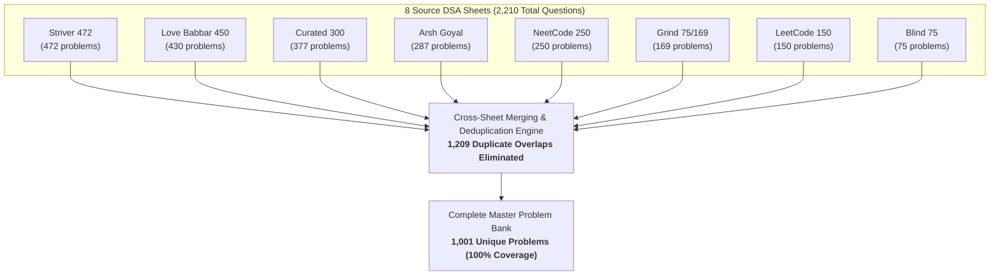

# 1001-problem-list

This master problem bank is a **unified, deduplicated consolidation** of all the top industry-standard DSA preparation sheets found in the `dsa-questions` directory. By merging every source and stripping away duplicates, it provides **100% comprehensive coverage** organized into **interactive collapsible categories**.

## Source Sheets Breakdown

Each individual sheet was merged and cross-deduplicated into this single unified 1,001 problem bank:

| Sheet Name | Source / Sheet Link | Problem Count | Primary Focus |
| :--- | :--- | :---: | :--- |
| **Striver SDE / A2Z Sheet** | [Take U Forward A2Z](https://takeuforward.org/dsa/strivers-a2z-sheet-learn-dsa-a-to-z) | **472** | Core algorithms, data structures & patterns |
| **Love Babbar 450 Sheet** | [GeeksforGeeks Love Babbar](https://www.geeksforgeeks.org/dsa/dsa-sheet-by-love-babbar/) | **430** | Classic interview favorites & fundamentals |
| **Arsh Goyal DSA Sheet** | [Arsh Goyal DSA Sheet](https://www.proelevate.in/dsa-practice/arsh-dsa-sheet) | **287** | Top product-based company interview questions |
| **NeetCode 250** | [NeetCode 250](https://neetcode.io/practice/practice/neetcode250) | **250** | High-frequency pattern-based coding list |
| **Grind 75 / 169** | [Grind 75](https://www.techinterviewhandbook.org/grind75/?weeks=28&hours=6) | **169** | High-yield curated LeetCode questions |
| **LeetCode Top Interview 150** | [LeetCode Top 150](https://leetcode.com/problem-list/plakya4j/) | **150** | Official LeetCode top interview study plan |
| **Blind 75** | [Blind 75](https://leetcode.com/discuss/general-discussion/460599/blind-75-leetcode-questions) | **75** | Canonical baseline LeetCode problems |
| **Total Problems Across All Sheets** | — | **1,833** | *Contains 1,209 cross-sheet duplicates* |
| **Unified Master Problem Bank** | — | **1,001** | **100% deduplicated coverage of all 8 sheets** |

## Convergence & Deduplication Architecture

The diagram below illustrates how all 8 popular sheets converge into the 1,001 Master Problem Bank by eliminating **1,209 redundant cross-sheet duplicates**:

---

## Table of Contents (Data Structure & Pattern Map)

1. [**Arrays, Strings & Hashing**](#arrays-strings-hashing) — *349 problems*
   - [Two Pointers & Sliding Window](#two-pointers-sliding-window) (*25 problems*)
   - [Prefix Sums & Frequency Hashing](#prefix-sums-frequency-hashing) (*13 problems*)
   - [Intervals & Sweep-Line](#intervals-sweep-line) (*10 problems*)
   - [2D Matrices & State Transformations](#2d-matrices-state-transformations) (*19 problems*)
   - [Array & String Fundamentals](#array-string-fundamentals) (*282 problems*)
2. [**Searching & Sorting**](#searching-sorting) — *58 problems*
   - [Binary Search (Index & Answer Space)](#binary-search-index-answer-space) (*19 problems*)
   - [Sorting Algorithms & Order Statistics](#sorting-algorithms-order-statistics) (*39 problems*)
3. [**Linked Lists**](#linked-lists) — *67 problems*
   - [Linked List Patterns & Pointer Reversal](#linked-list-patterns-pointer-reversal) (*67 problems*)
4. [**Stacks & Queues**](#stacks-queues) — *60 problems*
   - [Monotonic Stack & Monotonic Queue](#monotonic-stack-monotonic-queue) (*14 problems*)
   - [Stacks, Queues & Expression Parsing](#stacks-queues-expression-parsing) (*46 problems*)
5. [**Binary Trees & BST**](#binary-trees-bst) — *132 problems*
   - [Tree DFS (Traversals, Properties & Path Accumulation)](#tree-dfs-traversals-properties-path-accumulation) (*60 problems*)
   - [Tree BFS (Level-Order, Zigzag & Radial Propagation)](#tree-bfs-level-order-zigzag-radial-propagation) (*17 problems*)
   - [Binary Search Tree (BST) Properties & Operations](#binary-search-tree-bst-properties-operations) (*55 problems*)
6. [**Heaps & Priority Queues**](#heaps-priority-queues) — *37 problems*
   - [Heaps, Priority Queues & Top-K Patterns](#heaps-priority-queues-top-k-patterns) (*37 problems*)
7. [**Graphs**](#graphs) — *95 problems*
   - [Graph Traversal, Connected Components & Cycle Detection](#graph-traversal-connected-components-cycle-detection) (*37 problems*)
   - [Multi-Source BFS & Grid Shortest Path](#multi-source-bfs-grid-shortest-path) (*13 problems*)
   - [Topological Sort & DAG Dependencies (Kahn Algorithm)](#topological-sort-dag-dependencies-kahn-algorithm) (*10 problems*)
   - [Shortest Path Algorithms (Dijkstra, Bellman-Ford, Floyd-Warshall)](#shortest-path-algorithms-dijkstra-bellman-ford-floyd-warshall) (*16 problems*)
   - [Disjoint Set Union (DSU) & Minimum Spanning Tree (MST)](#disjoint-set-union-dsu-minimum-spanning-tree-mst) (*19 problems*)
8. [**Dynamic Programming (DP)**](#dynamic-programming-dp) — *124 problems*
   - [Dynamic Programming Patterns](#dynamic-programming-patterns) (*124 problems*)
9. [**Backtracking & Recursion**](#backtracking-recursion) — *32 problems*
   - [Backtracking & Exhaustive Search](#backtracking-exhaustive-search) (*32 problems*)
10. [**Tries & Advanced Data Structures**](#tries-advanced-data-structures) — *5 problems*
   - [Prefix Trees & Word Dictionaries](#prefix-trees-word-dictionaries) (*4 problems*)
   - [Bitwise Trie & Maximum XOR](#bitwise-trie-maximum-xor) (*1 problems*)
11. [**Bit Manipulation & Math**](#bit-manipulation-math) — *31 problems*
   - [Bit Manipulation & Number Theory](#bit-manipulation-number-theory) (*31 problems*)
12. [**Greedy Algorithms**](#greedy-algorithms) — *11 problems*
   - [Greedy Algorithms & Optimization](#greedy-algorithms-optimization) (*11 problems*)

---

  1. Arrays, Strings & Hashing (349 Problems)

  1.1 Two Pointers & Sliding Window (25 Problems)

1. [3Sum](https://leetcode.com/problems/3sum)
2. [3Sum Closest](https://leetcode.com/problems/3sum-closest)
3. [4Sum](https://leetcode.com/problems/4sum/)
4. [Boats to Save People](https://leetcode.com/problems/boats-to-save-people/)
5. [Check if two strings are anagram of each other](https://leetcode.com/problems/check-if-two-strings-are-anagram-of-each-other/)
6. [Container With Most Water](https://leetcode.com/problems/container-with-most-water)
7. [Count number of Nice subarrays](https://leetcode.com/problems/count-number-of-nice-subarrays/)
8. [Fruit Into Baskets](https://leetcode.com/problems/fruit-into-baskets/)
9. [Group Anagrams](https://leetcode.com/problems/group-anagrams)
10. [Is Subsequence](https://leetcode.com/problems/is-subsequence/)
11. [Max Consecutive Ones III](https://leetcode.com/problems/max-consecutive-ones-iii/)
12. [Minimum Size Subarray Sum](https://leetcode.com/problems/minimum-size-subarray-sum/)
13. [Minimum Window Subsequence](https://leetcode.com/problems/minimum-window-subsequence/)
14. [Move Zeroes](https://leetcode.com/problems/move-zeroes)
15. [Move Zeros to End](https://leetcode.com/problems/move-zeros-to-end/)
16. [Permutation In String](https://leetcode.com/problems/permutation-in-string/)
17. [Print Anagrams Together](https://www.geeksforgeeks.org/problems/print-anagrams-together/1)
18. [Reverse words in a given string / Palindrome Check](https://leetcode.com/problems/reverse-words-in-a-given-string/)
19. [Reverse Words in a String](https://leetcode.com/problems/reverse-words-in-a-string)
20. [Subarrays with K Different Integers](https://leetcode.com/problems/subarrays-with-k-different-integers/)
21. [Trapping Rainwater](https://leetcode.com/problems/trapping-rain-water/)
22. [Two Sum](https://leetcode.com/problems/two-sum)
23. [Two sum -Pairs with 0 Sum](https://www.geeksforgeeks.org/problems/count-pairs-with-given-sum5022/1)
24. [Valid Anagram](https://leetcode.com/problems/valid-anagram)
25. [Valid Palindrome](https://leetcode.com/problems/valid-palindrome)

  1.2 Prefix Sums & Frequency Hashing (13 Problems)

26. [Basic Hashing](https://leetcode.com/problems/basic-hashing/)
27. [Contains Duplicate](https://leetcode.com/problems/contains-duplicate)
28. [Contiguous Array](https://leetcode.com/problems/contiguous-array)
29. [Design HashMap](https://leetcode.com/problems/design-hashmap/)
30. [Design HashSet](https://leetcode.com/problems/design-hashset/)
31. [Hashing In Strings | Theory](https://leetcode.com/problems/hashing-in-strings-theory/)
32. [Insert Delete GetRandom O(1)](https://leetcode.com/problems/insert-delete-getrandom-o1)
33. [Longest Consecutive Sequence](https://leetcode.com/problems/longest-consecutive-sequence)
34. [Print subarray with maximum subarray sum (extended version of above problem)](https://leetcode.com/problems/print-subarray-with-maximum-subarray-sum/)
35. [Product of Array Except Self](https://leetcode.com/problems/product-of-array-except-self)
36. [Random Pick with Weight](https://leetcode.com/problems/random-pick-with-weight)
37. [Subarray Sum Equals K](https://leetcode.com/problems/subarray-sum-equals-k)
38. [Subarray Sums Divisible by K](https://leetcode.com/problems/subarray-sums-divisible-by-k)

  1.3 Intervals & Sweep-Line (10 Problems)

39. [Car Pooling](https://leetcode.com/problems/car-pooling/)
40. [Employee Free Time](https://leetcode.com/problems/employee-free-time)
41. [Insert Interval](https://leetcode.com/problems/insert-interval)
42. [Meeting Rooms](https://leetcode.com/problems/meeting-rooms)
43. [Merge Intervals](https://leetcode.com/problems/merge-intervals)
44. [Merge Overlapping Subintervals](https://leetcode.com/problems/merge-overlapping-subintervals/)
45. [Minimum Interval to Include Each Query](https://leetcode.com/problems/minimum-interval-to-include-each-query/)
46. [Minimum number of platforms required for a railway](https://leetcode.com/problems/minimum-number-of-platforms-required-for-a-railway/)
47. [Minimum Platforms](https://www.geeksforgeeks.org/problems/minimum-platforms-1587115620/1)
48. [Overlapping Intervals](https://www.geeksforgeeks.org/problems/overlapping-intervals--170633/1)

  1.4 2D Matrices & State Transformations (19 Problems)

49. [Build a Matrix With Conditions](https://leetcode.com/problems/build-a-matrix-with-conditions/)
50. [Find A Specific Pair In Matrix](https://www.geeksforgeeks.org/find-a-specific-pair-in-matrix/)
51. [Find the string in grid](https://www.geeksforgeeks.org/problems/find-the-string-in-grid0111/1)
52. [Game of Life](https://leetcode.com/problems/game-of-life)
53. [Given a matrix of ‘O’ and ‘X’, replace ‘O’ with ‘X’ if surrounded by ‘X’](https://www.geeksforgeeks.org/given-matrix-o-x-replace-o-x-surrounded-x/)
54. [Largest Area Rectangular Sub Matrix Equal Number 1s 0s](https://www.geeksforgeeks.org/largest-area-rectangular-sub-matrix-equal-number-1s-0s/)
55. [Largest Rectangular Sub Matrix Whose Sum 0](https://www.geeksforgeeks.org/largest-rectangular-sub-matrix-whose-sum-0/)
56. [Largest square formed in a matrix](https://www.geeksforgeeks.org/problems/largest-square-formed-in-a-matrix0806/1)
57. [Longest Increasing Path in a Matrix](https://leetcode.com/problems/longest-increasing-path-in-a-matrix)
58. [Longest Possible Route in a Matrix with Hurdles](https://www.geeksforgeeks.org/problems/longest-possible-route-in-a-matrix-with-hurdles/1)
59. [Print the matrix in spiral manner](https://leetcode.com/problems/print-the-matrix-in-spiral-manner/)
60. [Rotate A Matrix By 90 Degree In Clockwise Direction Without Using Any Extra Space](https://www.geeksforgeeks.org/rotate-a-matrix-by-90-degree-in-clockwise-direction-without-using-any-extra-space/)
61. [Rotate Image](https://leetcode.com/problems/rotate-image)
62. [Rotate matrix by 90 degrees](https://leetcode.com/problems/rotate-matrix-by-90-degrees/)
63. [Set Matrix Zeroes](https://leetcode.com/problems/remove-duplicates-from-sorted-array)
64. [Spiral Matrix](https://leetcode.com/problems/spiral-matrix)
65. [Transpose Matrix](https://leetcode.com/problems/transpose-matrix/)
66. [Unique rows in boolean matrix](https://www.geeksforgeeks.org/problems/unique-rows-in-boolean-matrix/1)
67. [Zig Zag or Spiral Traversal](https://leetcode.com/problems/zig-zag-or-spiral-traversal/)

  1.5 Array & String Fundamentals (282 Problems)

68. [A Program To Check If Strings Are Rotations Of Each Other](https://www.geeksforgeeks.org/a-program-to-check-if-strings-are-rotations-of-each-other/)
69. [Add Binary](https://leetcode.com/problems/add-binary)
70. [AGGRCOW](https://www.spoj.com/problems/AGGRCOW/)
71. [ANARC05B](https://www.spoj.com/problems/ANARC05B/)
72. [Arithmetic Expression Evalution](https://www.geeksforgeeks.org/arithmetic-expression-evalution/#:~:text=The%20stack%20organization%20is%20very,i.e.%2C%20A%20%2B%20B\)
73. [Arithmetic Number](https://www.geeksforgeeks.org/problems/arithmetic-number2815/1)
74. [ARRANGE](https://www.spoj.com/problems/ARRANGE/)
75. [Array Subset](https://www.geeksforgeeks.org/problems/array-subset-of-another-array2317/1)
76. [Backspace String Compare](https://leetcode.com/problems/backspace-string-compare)
77. [Balanced Paranthesis](https://leetcode.com/problems/balanced-paranthesis/)
78. [Beautiful Arrangement](https://leetcode.com/problems/beautiful-arrangement)
79. [Binary Subarrays With Sum](https://leetcode.com/problems/binary-subarrays-with-sum/)
80. [Boyer Moore Algorithm for Pattern Searching](https://www.geeksforgeeks.org/boyer-moore-algorithm-for-pattern-searching/)
81. [Buy Maximum Stocks Stocks Can Bought Th Day](https://www.geeksforgeeks.org/buy-maximum-stocks-stocks-can-bought-th-day/)
82. [Car Fleet](https://leetcode.com/problems/car-fleet/)
83. [Check if a Number is Odd or Not](https://leetcode.com/problems/check-if-a-number-is-odd-or-not/)
84. [Check if there exists a subsequence with sum K](https://leetcode.com/problems/check-if-there-exists-a-subsequence-with-sum-k/)
85. [CHOCOLA](https://www.spoj.com/problems/CHOCOLA/)
86. [CHOCOLA - Chocolate](https://www.spoj.com/problems/CHOCOLA/)
87. [Chocolate Distribution Problem](https://www.geeksforgeeks.org/problems/chocolate-distribution-problem3825/1)
88. [Choose and Swap](https://www.geeksforgeeks.org/problems/choose-and-swap0531/1)
89. [Coin Game Winner Every Player Three Choices](https://www.geeksforgeeks.org/coin-game-winner-every-player-three-choices/)
90. [Concatenation of Array](https://leetcode.com/problems/concatenation-of-array/)
91. [Construct a BT from Preorder and Inorder](https://leetcode.com/problems/construct-a-bt-from-preorder-and-inorder/)
92. [Convert Sentence Equivalent Mobile Numeric Keypad Sequence](https://www.geeksforgeeks.org/convert-sentence-equivalent-mobile-numeric-keypad-sequence/)
93. [Count and Say](https://leetcode.com/problems/count-and-say)
94. [Count Derangements Permutation Such That No Element Appears In Its Original Position](https://www.geeksforgeeks.org/count-derangements-permutation-such-that-no-element-appears-in-its-original-position/)
95. [Count Good Numbers](https://leetcode.com/problems/count-good-numbers/)
96. [Count of Range Sum](https://leetcode.com/problems/count-of-range-sum)
97. [Count Palindromic Subsequences](https://www.geeksforgeeks.org/problems/count-palindromic-subsequences/1)
98. [Count partitions with given difference](https://www.geeksforgeeks.org/problems/partitions-with-given-difference/1)
99. [Count Squares](https://www.geeksforgeeks.org/problems/count-squares3649/1)
100. [Count subarrays with given sum](https://leetcode.com/problems/count-subarrays-with-given-sum/)
101. [Count Subsequences Product Less K](https://www.geeksforgeeks.org/count-subsequences-product-less-k/)
102. [Count the Number of Set Bi](https://leetcode.com/problems/count-the-number-of-set-bi/)
103. [Count the Reversals](https://www.geeksforgeeks.org/problems/count-the-reversals0401/1)
104. [Count total nodes in a complete BT](https://leetcode.com/problems/count-total-nodes-in-a-complete-bt/)
105. [Counting Frequencies of Array Elements](https://leetcode.com/problems/counting-frequencies-of-array-elements/)
106. [Cpp Basics](https://leetcode.com/problems/cpp-basics/)
107. [Critical Connections in a Network](https://leetcode.com/problems/critical-connections-in-a-network)
108. [DEFKIN](https://www.spoj.com/problems/DEFKIN/)
109. [Delete and Earn](https://leetcode.com/problems/delete-and-earn)
110. [Delete nodes having greater value on right](https://www.geeksforgeeks.org/problems/delete-nodes-having-greater-value-on-right/1)
111. [Design Add and Search Words Data Structure](https://leetcode.com/problems/design-add-and-search-words-data-structure)
112. [Design In-Memory File System](https://leetcode.com/problems/design-in-memory-file-system)
113. [Detect Squares](https://leetcode.com/problems/detect-squares/)
114. [DFS](https://leetcode.com/problems/dfs/)
115. [DIEHARD](https://www.spoj.com/problems/DIEHARD/)
116. [Different Ways to Evaluate a Boolean Expression](https://leetcode.com/problems/different-ways-to-evaluate-a-boolean-expression/)
117. [Djisktra's Algorithm](https://leetcode.com/problems/djisktra-s-algorithm/)
118. [Easy and Medium](https://leetcode.com/problems/easy-and-medium/)
119. [EKO](https://www.spoj.com/problems/EKO/)
120. [Evaluate Division](https://leetcode.com/problems/evaluate-division)
121. [Evaluation of Postfix Expression](https://www.geeksforgeeks.org/problems/evaluation-of-postfix-expression1735/1)
122. [Excel Sheet Column Title](https://leetcode.com/problems/excel-sheet-column-title)
123. [Extra Characters in a String](https://leetcode.com/problems/extra-characters-in-a-string/)
124. [Find Count Number Given String Present 2d Character Array](https://www.geeksforgeeks.org/find-count-number-given-string-present-2d-character-array/)
125. [Find If There Is A Path Of More Than K Length From A Source](https://www.geeksforgeeks.org/find-if-there-is-a-path-of-more-than-k-length-from-a-source/)
126. [Find in Mountain Array](https://leetcode.com/problems/find-in-mountain-array/)
127. [Find Maximum Meetings In One Room](https://www.geeksforgeeks.org/find-maximum-meetings-in-one-room/)
128. [Find missing number](https://leetcode.com/problems/find-missing-number/)
129. [Find out how many times the array is rotated](https://leetcode.com/problems/find-out-how-many-times-the-array-is-rotated/)
130. [Find Pair Given Difference](https://www.geeksforgeeks.org/problems/find-pair-given-difference1559/1)
131. [Find row with maximum 1's](https://leetcode.com/problems/find-row-with-maximum-1-s/)
132. [Find Shortest Safe Route In A Path With Landmines](https://www.geeksforgeeks.org/find-shortest-safe-route-in-a-path-with-landmines/)
133. [Find square root of a number](https://leetcode.com/problems/sqrtx/)
134. [Find the Duplicate Number](https://leetcode.com/problems/find-the-duplicate-number)
135. [Find the Index of the First Occurrence in a String](https://leetcode.com/problems/find-the-index-of-the-first-occurrence-in-a-string)
136. [Find The K Th Permutation Sequence Of First N Natural Numbers](https://www.geeksforgeeks.org/find-the-k-th-permutation-sequence-of-first-n-natural-numbers/)
137. [Find the Most Competitive Subsequence](https://leetcode.com/problems/find-the-most-competitive-subsequence)
138. [Find the number that appears once, and other numbers twice.](https://leetcode.com/problems/find-the-number-that-appears-once-and-other-numbers-twice/)
139. [Find the repeating and missing number](https://leetcode.com/problems/find-the-repeating-and-missing-number/)
140. [Find the Town Judge](https://leetcode.com/problems/find-the-town-judge/)
141. [First and last occurrence](https://leetcode.com/problems/first-and-last-occurrence/)
142. [First negative in every window of size k](https://www.geeksforgeeks.org/problems/first-negative-integer-in-every-window-of-size-k3345/1)
143. [For loops](https://leetcode.com/problems/for-loops/)
144. [Four Sum](https://leetcode.com/problems/4sum)
145. [Function To Find Number Of Customers Who Could Not Get A Computer](https://www.geeksforgeeks.org/function-to-find-number-of-customers-who-could-not-get-a-computer/)
146. [Functions (Pass by Reference and Value)](https://leetcode.com/problems/functions/)
147. [Game with String](https://www.geeksforgeeks.org/problems/game-with-string4100/1)
148. [GCJ101BB](https://www.spoj.com/problems/GCJ101BB/)
149. [Generate Binary Strings Without Consecutive 1s](https://leetcode.com/problems/generate-binary-strings-without-consecutive-1s/)
150. [GERGOVIA](https://www.spoj.com/problems/GERGOVIA/)
151. [Given N Appointments Find Conflicting Appointments](https://www.geeksforgeeks.org/given-n-appointments-find-conflicting-appointments/)
152. [Greatest Common Divisor of Strings](https://leetcode.com/problems/greatest-common-divisor-of-strings/)
153. [Greatest Common Divisor Traversal](https://leetcode.com/problems/greatest-common-divisor-traversal/)
154. [Guess Number Higher Or Lower](https://leetcode.com/problems/guess-number-higher-or-lower/)
155. [Hand of Straights](https://leetcode.com/problems/hand-of-straights/)
156. [Happy Number](https://leetcode.com/problems/happy-number/)
157. [Hard](https://leetcode.com/problems/hard/)
158. [Highest Occurring Element in an Array](https://leetcode.com/problems/highest-occurring-element-in-an-array/)
159. [Huffman Encoding](https://www.geeksforgeeks.org/problems/huffman-encoding3345/1)
160. [If ElseIf](https://leetcode.com/problems/if-elseif/)
161. [Infix to Prefix Conversion](https://leetcode.com/problems/infix-to-prefix-conversion/)
162. [Input Output](https://leetcode.com/problems/input-output/)
163. [Integer Break](https://leetcode.com/problems/integer-break/)
164. [Integer to Roman](https://leetcode.com/problems/integer-to-roman)
165. [Interleaved Strings](https://www.geeksforgeeks.org/problems/interleaved-strings/1)
166. [Island Perimeter](https://leetcode.com/problems/island-perimeter/)
167. [Isomorphic String](https://leetcode.com/problems/isomorphic-string/)
168. [K-th element of two Arrays](https://www.geeksforgeeks.org/problems/k-th-element-of-two-sorted-array1317/1)
169. [K-th Largest Sum Contiguous Subarray](https://www.geeksforgeeks.org/problems/k-th-largest-sum-contiguous-subarray/1)
170. [Kadane's Algorithm](https://www.geeksforgeeks.org/problems/kadanes-algorithm-1587115620/1)
171. [KMP Algorithm or LPS array](https://leetcode.com/problems/kmp-algorithm-or-lps-array/)
172. [Kth Missing Positive Number](https://leetcode.com/problems/kth-missing-positive-number/)
173. [Largest Divisible Subset](https://leetcode.com/problems/largest-divisible-subset/)
174. [Largest Element](https://leetcode.com/problems/largest-element/)
175. [Largest Odd Number in a String](https://leetcode.com/problems/largest-odd-number-in-a-string/)
176. [Leaders in an Array](https://www.geeksforgeeks.org/problems/leaders-in-an-array-1587115620/1)
177. [Left Rotate Array by K Places](https://leetcode.com/problems/left-rotate-array-by-k-places/)
178. [Length of Last Word](https://leetcode.com/problems/length-of-last-word/)
179. [Longest Common Prefix](https://leetcode.com/problems/longest-common-prefix)
180. [Longest happy prefix](https://leetcode.com/problems/longest-happy-prefix/)
181. [Longest Happy String](https://leetcode.com/problems/longest-happy-string/)
182. [Longest Palindrome](https://leetcode.com/problems/longest-palindrome)
183. [Longest Prefix Suffix](https://www.geeksforgeeks.org/problems/longest-prefix-suffix2527/1)
184. [Longest Repeating Character Replacement](https://leetcode.com/problems/longest-repeating-character-replacement)
185. [Longest Repeating Subsequence](https://www.geeksforgeeks.org/problems/longest-repeating-subsequence2004/1)
186. [Longest subarray with given sum K(positives)](https://leetcode.com/problems/longest-subarray-with-given-sum-k/)
187. [Longest subarray with sum K](https://leetcode.com/problems/longest-subarray-with-sum-k/)
188. [Longest subsequence-1](https://www.geeksforgeeks.org/problems/longest-subsequence-such-that-difference-between-adjacents-is-one4724/1)
189. [Longest Turbulent Subarray](https://leetcode.com/problems/longest-turbulent-subarray/)
190. [M](https://leetcode.com/problems/m/)
191. [Making A Large Island](https://leetcode.com/problems/making-a-large-island)
192. [Max Area of Island](https://leetcode.com/problems/max-area-of-island/)
193. [Maximal Square](https://leetcode.com/problems/maximal-square)
194. [Maximize sum after K negations](https://www.geeksforgeeks.org/problems/maximize-sum-after-k-negations1149/1)
195. [Maximum And Minimum In An Array](https://www.geeksforgeeks.org/maximum-and-minimum-in-an-array/)
196. [Maximum Consecutive Ones](https://leetcode.com/problems/maximum-consecutive-ones/)
197. [Maximum Depth in BT](https://leetcode.com/problems/maximum-depth-in-bt/)
198. [Maximum Length of Pair Chain](https://leetcode.com/problems/maximum-length-of-pair-chain)
199. [Maximum Length of Repeated Subarray](https://leetcode.com/problems/maximum-length-of-repeated-subarray)
200. [Maximum Number of Visible Points](https://leetcode.com/problems/maximum-number-of-visible-points)
201. [Maximum of minimum for every window size](https://www.geeksforgeeks.org/problems/maximum-of-minimum-for-every-window-size3453/1)
202. [Maximum Points You Can Obtain from Cards](https://leetcode.com/problems/maximum-points-you-can-obtain-from-cards)
203. [Maximum Product of Three Numbers](https://leetcode.com/problems/maximum-product-of-three-numbers)
204. [Maximum Profit in Job Scheduling](https://leetcode.com/problems/maximum-profit-in-job-scheduling)
205. [Maximum Rectangles](https://leetcode.com/problems/maximum-rectangles/)
206. [Maximum Subarray](https://leetcode.com/problems/maximum-subarray)
207. [Maximum Subsequence Sum Such That No Three Are Consecutive](https://www.geeksforgeeks.org/maximum-subsequence-sum-such-that-no-three-are-consecutive/)
208. [Maximum Sum Absolute Difference Array](https://www.geeksforgeeks.org/maximum-sum-absolute-difference-array/)
209. [Maximum Sum Circular Subarray](https://leetcode.com/problems/maximum-sum-circular-subarray/)
210. [Maximum Sum Combination](https://leetcode.com/problems/maximum-sum-combination/)
211. [Maximum sum of non adjacent elements](https://leetcode.com/problems/maximum-sum-of-non-adjacent-elements/)
212. [Maximum Trains Stoppage Can Provided](https://www.geeksforgeeks.org/maximum-trains-stoppage-can-provided/)
213. [Merge Strings Alternately](https://leetcode.com/problems/merge-strings-alternately/)
214. [Merge Triplets to Form Target Triplet](https://leetcode.com/problems/merge-triplets-to-form-target-triplet/)
215. [Merge Without Extra Space](https://www.geeksforgeeks.org/problems/merge-two-sorted-arrays-1587115620/1)
216. [Min Number of Flips](https://www.geeksforgeeks.org/problems/min-number-of-flips3210/1)
217. [Minimize Cash Flow among a given set of friends who have borrowed money from each other](https://www.geeksforgeeks.org/minimize-cash-flow-among-given-set-friends-borrowed-money/)
218. [Minimize Cash Flow Among Given Set Friends Borrowed Money](https://www.geeksforgeeks.org/minimize-cash-flow-among-given-set-friends-borrowed-money/)
219. [Minimize the Heights II](https://www.geeksforgeeks.org/problems/minimize-the-heights3351/1)
220. [Minimum Array End](https://leetcode.com/problems/minimum-array-end/)
221. [Minimum Characters Added Front Make String Palindrome](https://www.geeksforgeeks.org/minimum-characters-added-front-make-string-palindrome/)
222. [Minimum Cost Cut Board Squares](https://www.geeksforgeeks.org/minimum-cost-cut-board-squares/)
223. [Minimum cost to cut the stick](https://leetcode.com/problems/minimum-cost-to-cut-the-stick/)
224. [Minimum Cost to Merge Stones](https://leetcode.com/problems/minimum-cost-to-merge-stones)
225. [Minimum Deletions to Make Character Frequencies Unique](https://leetcode.com/problems/minimum-deletions-to-make-character-frequencies-unique)
226. [Minimum Edges Reverse Make Path Source Destination](https://www.geeksforgeeks.org/minimum-edges-reverse-make-path-source-destination/)
227. [Minimum Insertion Steps to Make a String Palindrome](https://leetcode.com/problems/minimum-insertion-steps-to-make-a-string-palindrome)
228. [Minimum insertions or deletions to convert string A to B](https://leetcode.com/problems/minimum-insertions-or-deletions-to-convert-string-a-to-b/)
229. [Minimum Jumps](https://www.geeksforgeeks.org/problems/minimum-number-of-jumps-1587115620/1)
230. [Minimum Moves to Equal Array Elements](https://leetcode.com/problems/minimum-moves-to-equal-array-elements-ii)
231. [Minimum Number of Refueling Stops](https://leetcode.com/problems/minimum-number-of-refueling-stops)
232. [Minimum Removals Array Make Max Min K](http://geeksforgeeks.org/minimum-removals-array-make-max-min-k/)
233. [Minimum sum](https://www.geeksforgeeks.org/problems/minimum-sum4058/1)
234. [Minimum Sum Absolute Difference Pairs Two Arrays](https://www.geeksforgeeks.org/minimum-sum-absolute-difference-pairs-two-arrays/)
235. [Minimum swaps and K together](https://www.geeksforgeeks.org/problems/minimum-swaps-required-to-bring-all-elements-less-than-or-equal-to-k-together4847/1)
236. [Minimum Time to Make Rope Colorful](https://leetcode.com/problems/minimum-time-to-make-rope-colorful)
237. [Missing And Repeating](https://www.geeksforgeeks.org/problems/find-missing-and-repeating2512/1)
238. [Missing Number](https://leetcode.com/problems/missing-number)
239. [Mobile numeric keypad](https://www.geeksforgeeks.org/problems/mobile-numeric-keypad5456/1)
240. [Move Negative Numbers Beginning Positive End Constant Extra Space](https://www.geeksforgeeks.org/move-negative-numbers-beginning-positive-end-constant-extra-space/)
241. [Multiply Strings](https://leetcode.com/problems/multiply-strings/)
242. [N-th Tribonacci Number](https://leetcode.com/problems/n-th-tribonacci-number/)
243. [nCr](https://www.geeksforgeeks.org/problems/ncr1019/1)
244. [Next Permutation](https://leetcode.com/problems/next-permutation)
245. [Ninja and his Friends](https://leetcode.com/problems/ninja-and-his-friends/)
246. [Ninja's training](https://www.geeksforgeeks.org/problems/geeks-training/1)
247. [Number of Greater Elements to the Right](https://leetcode.com/problems/number-of-greater-elements-to-the-right/)
248. [Number of ways to arrive at destination](https://leetcode.com/problems/number-of-ways-to-arrive-at-destination/)
249. [Optimum Location Point Minimize Total Distance](https://www.geeksforgeeks.org/optimum-location-point-minimize-total-distance/#:~:text=We%20need%20to%20find%20a,set%20of%20points%20is%20minimum.&text=In%20above%20figure%20optimum%20location,is%20minimum%20obtainable%20total%20distance.)
250. [Pairs with certain difference](https://www.geeksforgeeks.org/problems/pairs-with-specific-difference1533/1)
251. [Palindrome Pairs](https://leetcode.com/problems/palindrome-pairs)
252. [Palindrome String](https://www.geeksforgeeks.org/problems/palindrome-string0817/1)
253. [Palindromic Array](https://www.geeksforgeeks.org/problems/palindromic-array-1587115620/1)
254. [Partition Array for Maximum Sum](https://leetcode.com/problems/partition-array-for-maximum-sum/)
255. [Partition Labels](https://leetcode.com/problems/partition-labels/)
256. [Pascal's Triangle I](https://leetcode.com/problems/pascal-s-triangle-i/)
257. [Pattern 1](https://leetcode.com/problems/pattern-1/)
258. [Pattern 20](https://leetcode.com/problems/pattern-20/)
259. [Permutation Coefficient](https://www.geeksforgeeks.org/permutation-coefficient/)
260. [Permute two arrays such that sum of every pair is greater or equal to K](https://www.geeksforgeeks.org/permute-two-arrays-sum-every-pair-greater-equal-k/)
261. [Phone directory](https://www.geeksforgeeks.org/problems/phone-directory4628/1)
262. [Plus One](https://leetcode.com/problems/plus-one/)
263. [Postfix Evaluation](https://www.geeksforgeeks.org/problems/evaluation-of-postfix-expression1735/1)
264. [Postfix to Prefix Conversion](https://leetcode.com/problems/postfix-to-prefix-conversion/)
265. [PRATA](https://www.spoj.com/problems/PRATA/)
266. [Pre, Post, Inorder in one traversal](https://leetcode.com/problems/pre-post-inorder-in-one-traversal/)
267. [Predecessor and Successor](https://www.geeksforgeeks.org/problems/predecessor-and-successor/1)
268. [Prefix to Infix Conversion](https://leetcode.com/problems/prefix-to-infix-conversion/)
269. [Preorder To Postorder](https://www.geeksforgeeks.org/problems/preorder-to-postorder4423/1)
270. [Preorder Traversal](https://leetcode.com/problems/preorder-traversal/)
271. [Preorder, Inorder, and Postorder Traversal in one Traversal](https://leetcode.com/problems/preorder-inorder-and-postorder-traversal-in-one-traversal/)
272. [Print 1 to N using Recursion](https://leetcode.com/problems/print-1-to-n-using-recursion/)
273. [Print name N times using recursion](https://leetcode.com/problems/print-name-n-times-using-recursion/)
274. [Print Subsequences String](https://www.geeksforgeeks.org/print-subsequences-string/)
275. [Product array puzzle](https://www.geeksforgeeks.org/problems/product-array-puzzle4525/1)
276. [Program Generate Possible Valid Ip Addresses Given String](https://www.geeksforgeeks.org/program-generate-possible-valid-ip-addresses-given-string/)
277. [Program Nth Catalan Number](https://www.geeksforgeeks.org/program-nth-catalan-number/)
278. [Rabin Karp Algorithm](https://leetcode.com/problems/rabin-karp-algorithm/)
279. [Rabin-Karp Algorithm for Pattern Searching](https://www.geeksforgeeks.org/rabin-karp-algorithm-for-pattern-searching/)
280. [Range Sum Query - Mutable](https://leetcode.com/problems/range-sum-query-mutable)
281. [Ransom Note](https://leetcode.com/problems/ransom-note)
282. [rasta and kheshtak](https://www.hackerearth.com/practice/algorithms/searching/binary-search/practice-problems/algorithm/rasta-and-kheshtak/)
283. [Rearrange characters](https://www.geeksforgeeks.org/problems/rearrange-characters4649/1)
284. [Recursive Implementation of atoi()](https://leetcode.com/problems/recursive-implementation-of-atoi/)
285. [Remove Boxes](https://leetcode.com/problems/remove-boxes)
286. [Remove Consecutive Characters](https://www.geeksforgeeks.org/problems/consecutive-elements2306/1)
287. [Remove Element](https://leetcode.com/problems/remove-element/)
288. [Replace Elements by Their Rank](https://leetcode.com/problems/replace-elements-by-their-rank/)
289. [Replace every element with the least greater element on its right](https://www.geeksforgeeks.org/problems/replace-every-element-with-the-least-greater-element-on-its-right/1)
290. [Requirements needed to construct a unique BT](https://leetcode.com/problems/requirements-needed-to-construct-a-unique-bt/)
291. [Restore the Array From Adjacent Pairs](https://leetcode.com/problems/restore-the-array-from-adjacent-pairs)
292. [Reverse a number](https://leetcode.com/problems/reverse-a-number/)
293. [Reverse an array](https://leetcode.com/problems/reverse-an-array/)
294. [Reverse every word in a string](https://leetcode.com/problems/reverse-every-word-in-a-string/)
295. [Reverse Nodes in k-Group](https://leetcode.com/problems/reverse-nodes-in-k-group)
296. [Reverse Pairs](https://leetcode.com/problems/reverse-pairs)
297. [Reverse String](https://leetcode.com/problems/reverse-string)
298. [Roman Number to Integer](https://www.geeksforgeeks.org/problems/roman-number-to-integer3201/1)
299. [Rotate Array](https://leetcode.com/problems/rotate-array)
300. [Rotate Array by One](https://www.geeksforgeeks.org/problems/cyclically-rotate-an-array-by-one2614/1)
301. [Rotate String](https://leetcode.com/problems/rotate-string/)
302. [Row with max 1s](https://www.geeksforgeeks.org/problems/row-with-max-1s0023/1)
303. [Searching Array Adjacent Differ K](https://www.geeksforgeeks.org/searching-array-adjacent-differ-k/)
304. [Second Largest Element](https://leetcode.com/problems/second-largest-element/)
305. [Second most repeated string in a sequence](https://www.geeksforgeeks.org/problems/second-most-repeated-string-in-a-sequence0534/1)
306. [Shortest common supersequence](https://leetcode.com/problems/shortest-common-supersequence/)
307. [Shortest Job First](https://leetcode.com/problems/shortest-job-first/)
308. [Shortest Palindrome](https://leetcode.com/problems/shortest-palindrome/)
309. [Sqrt(x)](https://leetcode.com/problems/sqrtx/)
310. [STL](https://leetcode.com/problems/stl/)
311. [Stream First Non-repeating](https://www.geeksforgeeks.org/problems/first-non-repeating-character-in-a-stream1216/1)
312. [String to Integer (atoi)](https://leetcode.com/problems/string-to-integer-atoi)
313. [Subarray with 0 sum](https://www.geeksforgeeks.org/problems/subarray-with-0-sum-1587115621/1)
314. [Sum Except First and Last](https://www.geeksforgeeks.org/problems/max-length-chain/1)
315. [Sum Minimum Maximum Elements Subarrays Size K](https://www.geeksforgeeks.org/sum-minimum-maximum-elements-subarrays-size-k/)
316. [Sum of nodes on the longest path](https://www.geeksforgeeks.org/problems/sum-of-the-longest-bloodline-of-a-tree/1)
317. [Sum of Two Integers](https://leetcode.com/problems/sum-of-two-integers/)
318. [Summary Ranges](https://leetcode.com/problems/summary-ranges/)
319. [Survival](https://www.geeksforgeeks.org/survival/)
320. [Swap and Maximize](https://www.geeksforgeeks.org/problems/swap-and-maximize5859/1)
321. [Swap Two Numbers](https://leetcode.com/problems/swap-two-numbers/)
322. [Switch Case](https://leetcode.com/problems/switch-case/)
323. [Text Justification](https://leetcode.com/problems/text-justification)
324. [Theory with examples](https://leetcode.com/problems/theory-with-examples/)
325. [Three Sum](https://leetcode.com/problems/3sum)
326. [Three way partitioning](https://www.geeksforgeeks.org/problems/three-way-partitioning/1)
327. [Time Based Key-Value Store](https://leetcode.com/problems/time-based-key-value-store)
328. [Transform One String To Another Using Minimum Number Of Given Operation](https://www.geeksforgeeks.org/transform-one-string-to-another-using-minimum-number-of-given-operation/)
329. [Traversal Techniques](https://leetcode.com/problems/traversal-techniques/)
330. [Triangle](https://leetcode.com/problems/triangle/)
331. [Triplet Sum in Array](https://www.geeksforgeeks.org/problems/triplet-sum-in-array-1587115621/1)
332. [Ugly Number II](https://leetcode.com/problems/ugly-number-ii)
333. [Understand recursion by print something N times](https://leetcode.com/problems/understand-recursion-by-print-something-n-times/)
334. [Union of Arrays with Duplicates](https://www.geeksforgeeks.org/problems/union-of-two-arrays3538/1)
335. [Unique Number II](https://www.geeksforgeeks.org/problems/finding-the-numbers0215/1)
336. [Valid Number](https://leetcode.com/problems/valid-number)
337. [Valid Paranthesis Checker](https://leetcode.com/problems/valid-paranthesis-checker/)
338. [Value equal to index value](https://www.geeksforgeeks.org/problems/value-equal-to-index-value1330/1)
339. [Vertex Cover Problem Set 1 Introduction Approximate Algorithm 2](https://www.geeksforgeeks.org/vertex-cover-problem-set-1-introduction-approximate-algorithm-2/)
340. [Water Connection Problem](https://www.geeksforgeeks.org/problems/water-connection-problem5822/1)
341. [Weighted Job Scheduling](https://www.geeksforgeeks.org/problems/weighted-job-scheduling/1)
342. [Weighted Job Scheduling Log N Time](https://www.geeksforgeeks.org/weighted-job-scheduling-log-n-time/)
343. [What are arrays, strings?](https://leetcode.com/problems/what-are-arrays-strings/)
344. [While loops](https://leetcode.com/problems/while-loops/)
345. [Word Pattern](https://leetcode.com/problems/word-pattern/)
346. [Word Wrap](https://www.geeksforgeeks.org/problems/word-wrap1646/1)
347. [Write A Program To Reverse An Array Or String](https://www.geeksforgeeks.org/write-a-program-to-reverse-an-array-or-string/)
348. [Z function](https://leetcode.com/problems/z-function/)
349. [Zero Sum Subarrays](https://www.geeksforgeeks.org/problems/zero-sum-subarrays1825/1)

  2. Searching & Sorting (58 Problems)

  2.1 Binary Search (Index & Answer Space) (19 Problems)

350. [AGGRCOW - Aggressive cows](https://www.spoj.com/problems/AGGRCOW/)
351. [Aggressive Cows](https://leetcode.com/problems/aggressive-cows/)
352. [Binary Search](https://leetcode.com/problems/binary-search)
353. [Capacity to Ship Packages Within D Days](https://leetcode.com/problems/capacity-to-ship-packages-within-d-days/)
354. [Find Minimum in Rotated Sorted Array](https://leetcode.com/problems/find-minimum-in-rotated-sorted-array)
355. [Find Nth root of a number](https://www.geeksforgeeks.org/problems/find-nth-root-of-m5843/1)
356. [Find Peak Element](https://www.geeksforgeeks.org/make-array-elements-equal-minimum-cost/)
357. [First Bad Version](https://leetcode.com/problems/first-bad-version)
358. [Floor and Ceil in Sorted Array](https://leetcode.com/problems/floor-and-ceil-in-sorted-array/)
359. [Koko Eating Bananas](https://leetcode.com/problems/koko-eating-bananas/)
360. [Lower Bound](https://leetcode.com/problems/lower-bound/)
361. [Minimum days to make M bouquets](https://leetcode.com/problems/minimum-days-to-make-m-bouquets/)
362. [Painter's Partition](https://leetcode.com/problems/painter-s-partition/)
363. [Search a 2D Matrix](https://leetcode.com/problems/search-a-2d-matrix)
364. [Search in Rotated Sorted Array](https://leetcode.com/problems/search-in-rotated-sorted-array)
365. [Search Insert Position](https://leetcode.com/problems/search-insert-position/)
366. [Single element in a Sorted Array](https://leetcode.com/problems/single-element-in-a-sorted-array/)
367. [Split Array Largest Sum](https://leetcode.com/problems/split-array-largest-sum)
368. [Upper Bound](https://leetcode.com/problems/upper-bound/)

  2.2 Sorting Algorithms & Order Statistics (39 Problems)

369. [Bubble Sort](https://leetcode.com/problems/bubble-sort/)
370. [Ceiling in a sorted array](https://www.geeksforgeeks.org/ceiling-in-a-sorted-array/)
371. [Check if reversing a sub array make the array sorted](https://www.geeksforgeeks.org/check-reversing-sub-array-make-array-sorted/)
372. [Check if the Array is Sorted II](https://leetcode.com/problems/check-if-the-array-is-sorted-ii/)
373. [Common in 3 Sorted Arrays](https://www.geeksforgeeks.org/problems/common-elements1132/1)
374. [Count Inversions](https://www.geeksforgeeks.org/problems/inversion-of-array-1587115620/1)
375. [Count Occurrences in a Sorted Array](https://leetcode.com/problems/count-occurrences-in-a-sorted-array/)
376. [Find First and Last Position of Element in Sorted Array](https://leetcode.com/problems/find-first-and-last-position-of-element-in-sorted-array/)
377. [First Missing Positive](https://leetcode.com/problems/first-missing-positive)
378. [H-Index](https://leetcode.com/problems/h-index/)
379. [In Place Merge Sort](https://www.geeksforgeeks.org/in-place-merge-sort/)
380. [Insertion Sorting](https://leetcode.com/problems/insertion-sorting/)
381. [Kth element of 2 sorted arrays](https://leetcode.com/problems/kth-element-of-2-sorted-arrays/)
382. [Largest Number](https://leetcode.com/problems/largest-number)
383. [Largest number in K swaps](https://www.geeksforgeeks.org/problems/largest-number-in-k-swaps-1587115620/1)
384. [Linear Search](https://leetcode.com/problems/linear-search/)
385. [Majority Element](https://leetcode.com/problems/majority-element)
386. [Merge Sorted Array](https://leetcode.com/problems/merge-sorted-array)
387. [Merge Sorting](https://leetcode.com/problems/merge-sorting/)
388. [Merge two sorted arrays without extra space](https://leetcode.com/problems/merge-two-sorted-arrays-without-extra-space/)
389. [Minimum Swaps to Sort](https://www.geeksforgeeks.org/problems/minimum-swaps/1)
390. [Quick Sorting](https://leetcode.com/problems/quick-sorting/)
391. [Radix Sort](https://www.geeksforgeeks.org/problems/radix-sort/1)
392. [Rearrange Array Alternating Positive Negative Items O1 Extra Space](https://www.geeksforgeeks.org/rearrange-array-alternating-positive-negative-items-o1-extra-space/)
393. [Rearrange array elements by sign](https://leetcode.com/problems/rearrange-array-elements-by-sign/)
394. [Recursive Bubble Sort](https://leetcode.com/problems/recursive-bubble-sort/)
395. [Recursive Insertion Sort](https://leetcode.com/problems/recursive-insertion-sort/)
396. [Search X in sorted array](https://leetcode.com/problems/search-x-in-sorted-array/)
397. [Selection Sort](https://leetcode.com/problems/selection-sort/)
398. [Sort 0s, 1s and 2s](https://www.geeksforgeeks.org/problems/sort-an-array-of-0s-1s-and-2s4231/1)
399. [Sort an Array](https://leetcode.com/problems/sort-an-array/)
400. [Sort by Set Bit Count](https://www.geeksforgeeks.org/problems/sort-by-set-bit-count1153/1)
401. [Sort Characters by Frequency](https://leetcode.com/problems/sort-characters-by-frequency/)
402. [Sort Colors](https://leetcode.com/problems/sort-colors)
403. [Sort K sorted array](https://www.geeksforgeeks.org/problems/nearly-sorted-1587115620/1)
404. [Sorted matrix](https://www.geeksforgeeks.org/problems/sorted-matrix2333/1)
405. [Squares of a Sorted Array](https://leetcode.com/problems/squares-of-a-sorted-array)
406. [Two Sum II - Input Array Is Sorted](https://leetcode.com/problems/two-sum-ii-input-array-is-sorted/)
407. [Union of two sorted arrays](https://leetcode.com/problems/union-of-two-sorted-arrays/)

  3. Linked Lists (67 Problems)

  3.1 Linked List Patterns & Pointer Reversal (67 Problems)

408. [4 Sum - All Quadruples](https://www.geeksforgeeks.org/problems/find-all-four-sum-numbers1732/1)
409. [Add one to a number represented by LL](https://leetcode.com/problems/add-one-to-a-number-represented-by-ll/)
410. [Add Two Numbers](https://leetcode.com/problems/add-two-numbers)
411. [Allocate Minimum Pages](https://www.geeksforgeeks.org/problems/allocate-minimum-number-of-pages0937/1)
412. [Book Allocation Problem](https://leetcode.com/problems/book-allocation-problem/)
413. [Check if LL is palindrome or not](https://leetcode.com/problems/check-if-ll-is-palindrome-or-not/)
414. [Clone a LL with random and next pointer](https://leetcode.com/problems/clone-a-ll-with-random-and-next-pointer/)
415. [Common Elements In All Rows Of A Given Matrix](https://www.geeksforgeeks.org/common-elements-in-all-rows-of-a-given-matrix/)
416. [Count all Digits of a Number](https://leetcode.com/problems/count-all-digits-of-a-number/)
417. [Count all subsequences with sum K](https://leetcode.com/problems/count-all-subsequences-with-sum-k/)
418. [Count of Smaller Numbers After Self](https://leetcode.com/problems/count-of-smaller-numbers-after-self)
419. [Delete all occurrences of a key in DLL](https://leetcode.com/problems/delete-all-occurrences-of-a-key-in-dll/)
420. [Delete the middle node in LL](https://leetcode.com/problems/delete-the-middle-node-in-ll/)
421. [Deletion of the head of LL](https://leetcode.com/problems/deletion-of-the-head-of-ll/)
422. [Detect a loop in LL](https://leetcode.com/problems/detect-a-loop-in-ll/)
423. [Find All Anagrams in a String](https://leetcode.com/problems/find-all-anagrams-in-a-string)
424. [Find All Duplicates in an Array](https://leetcode.com/problems/find-all-duplicates-in-an-array)
425. [Find All Possible Palindromic Partitions of a String](https://www.geeksforgeeks.org/problems/find-all-possible-palindromic-partitions-of-a-string/1)
426. [Find K Pairs with Smallest Sums](https://leetcode.com/problems/find-k-pairs-with-smallest-sums/)
427. [Find Paths From Corner Cell To Middle Cell In Maze](https://www.geeksforgeeks.org/find-paths-from-corner-cell-to-middle-cell-in-maze/)
428. [Find the city with the smallest number of neighbors](https://leetcode.com/problems/find-the-city-with-the-smallest-number-of-neighbors/)
429. [Find the City With the Smallest Number of Neighbors at a Threshold Distance](https://leetcode.com/problems/find-the-city-with-the-smallest-number-of-neighbors-at-a-threshold-distance)
430. [Find the intersection point of Y LL](https://leetcode.com/problems/find-the-intersection-point-of-y-ll/)
431. [Find the smallest divisor](https://leetcode.com/problems/find-the-smallest-divisor/)
432. [Find the starting point in LL](https://leetcode.com/problems/find-the-starting-point-in-ll/)
433. [Flattening of LL](https://leetcode.com/problems/flattening-of-ll/)
434. [Flood Fill](https://leetcode.com/problems/flood-fill)
435. [Flood fill algorithm](https://leetcode.com/problems/flood-fill-algorithm/)
436. [Given A String Print All Possible Palindromic Partition](https://www.geeksforgeeks.org/given-a-string-print-all-possible-palindromic-partition/)
437. [Given An Array Of Of Size N Finds All The Elements That Appear More Than Nk Times](https://www.geeksforgeeks.org/given-an-array-of-of-size-n-finds-all-the-elements-that-appear-more-than-nk-times/)
438. [Insert Delete GetRandom O(1) - Duplicates allowed](https://leetcode.com/problems/insert-delete-getrandom-o1-duplicates-allowed)
439. [Introduction to Doubly LL](https://leetcode.com/problems/introduction-to-doubly-ll/)
440. [Java Collections](https://leetcode.com/problems/java-collections/)
441. [Learn All Patterns of Subsequences (Theory)](https://leetcode.com/problems/learn-all-patterns-of-subsequences/)
442. [Length of loop in LL](https://leetcode.com/problems/length-of-loop-in-ll/)
443. [Longest Word with All Prefixes](https://leetcode.com/problems/longest-word-with-all-prefixes/)
444. [Maximum Profit By Buying And Selling A Share At Most Twice](https://www.geeksforgeeks.org/maximum-profit-by-buying-and-selling-a-share-at-most-twice/)
445. [Maximum size rectangle binary sub-matrix with all 1s](https://www.geeksforgeeks.org/maximum-size-rectangle-binary-sub-matrix-1s/)
446. [Middle of Three](https://www.geeksforgeeks.org/problems/middle-of-three2926/1)
447. [Minimum cost for acquiring all coins with k extra coins allowed with every coin](https://www.geeksforgeeks.org/minimum-cost-for-acquiring-all-coins-with-k-extra-coins-allowed-with-every-coin/)
448. [Minimum cost to fill given weight in a bag](https://www.geeksforgeeks.org/problems/minimum-cost-to-fill-given-weight-in-a-bag1956/1)
449. [Populate Inorder Successor for all nodes](https://www.geeksforgeeks.org/problems/populate-inorder-successor-for-all-nodes/1)
450. [Print all Divisors](https://leetcode.com/problems/print-all-divisors/)
451. [Print all nodes at a distance of K in BT](https://leetcode.com/problems/print-all-nodes-at-a-distance-of-k-in-bt/)
452. [Print All Possible Paths From Top Left To Bottom Right Of A Mxn Matrix](https://www.geeksforgeeks.org/print-all-possible-paths-from-top-left-to-bottom-right-of-a-mxn-matrix/)
453. [Print all the duplicate characters in a string](https://www.geeksforgeeks.org/print-all-the-duplicates-in-the-input-string/)
454. [Print All The Duplicates In The Input String](https://www.geeksforgeeks.org/print-all-the-duplicates-in-the-input-string/)
455. [Remove All Adjacent Duplicates in String II](https://leetcode.com/problems/remove-all-adjacent-duplicates-in-string-ii)
456. [Remove duplicates from sorted DLL](https://leetcode.com/problems/remove-duplicates-from-sorted-dll/)
457. [Remove Nth node from the back of the LL](https://leetcode.com/problems/remove-nth-node-from-the-back-of-the-ll/)
458. [Reverse a LL](https://leetcode.com/problems/reverse-a-ll/)
459. [Reverse LL in group of given size K](https://leetcode.com/problems/reverse-ll-in-group-of-given-size-k/)
460. [Rotate a LL](https://leetcode.com/problems/rotate-a-ll/)
461. [Smallest distinct window](https://www.geeksforgeeks.org/problems/smallest-distant-window3132/1)
462. [Smallest number](https://www.geeksforgeeks.org/problems/smallest-number5829/1)
463. [Smallest number with at least n trailing zeroes in factorial](https://www.geeksforgeeks.org/problems/smallest-factorial-number5929/1)
464. [Smallest Positive missing number](https://www.geeksforgeeks.org/problems/smallest-positive-missing-number-1587115621/1)
465. [Smallest subarray with sum greater than x](https://www.geeksforgeeks.org/problems/smallest-subarray-with-sum-greater-than-x5651/1)
466. [Smallest sum contiguous subarray](https://www.geeksforgeeks.org/problems/smallest-sum-contiguous-subarray/1)
467. [Smallest window containing all characters](https://www.geeksforgeeks.org/problems/smallest-window-in-a-string-containing-all-the-characters-of-another-string-1587115621/1)
468. [Smallest window in a string containing all the characters of another string](https://www.geeksforgeeks.org/problems/smallest-window-in-a-string-containing-all-the-characters-of-another-string-1587115621/1)
469. [Sort LL](https://leetcode.com/problems/sort-ll/)
470. [Spirally traversing a matrix](https://www.geeksforgeeks.org/problems/spirally-traversing-a-matrix-1587115621/1)
471. [Swap Nodes in Pairs](https://leetcode.com/problems/swap-nodes-in-pairs)
472. [Travelling Salesman Problem Set 1](https://www.geeksforgeeks.org/travelling-salesman-problem-set-1/)
473. [Travelling Salesman Problem using Dynamic Programming](https://www.geeksforgeeks.org/travelling-salesman-problem-using-dynamic-programming/)
474. [Triplets with Smaller Sum](https://www.geeksforgeeks.org/problems/count-triplets-with-sum-smaller-than-x5549/1)

  4. Stacks & Queues (60 Problems)

  4.1 Monotonic Stack & Monotonic Queue (14 Problems)

475. [Daily Temperatures](https://leetcode.com/problems/daily-temperatures)
476. [Histogram Max Rectangular Area](https://www.geeksforgeeks.org/problems/maximum-rectangular-area-in-a-histogram-1587115620/1)
477. [Largest Rectangle in Histogram](https://leetcode.com/problems/largest-rectangle-in-histogram)
478. [Max rectangle](https://www.geeksforgeeks.org/problems/max-rectangle/1)
479. [Max Value of Equation](https://leetcode.com/problems/max-value-of-equation)
480. [Next Greater Element](https://www.geeksforgeeks.org/problems/next-larger-element-1587115620/1)
481. [Next Smaller Element](https://www.geeksforgeeks.org/next-smaller-element/)
482. [Online Stock Span](https://leetcode.com/problems/online-stock-span)
483. [Remove K Digits](https://leetcode.com/problems/remove-k-digits)
484. [Sliding Window Maximum](https://leetcode.com/problems/sliding-window-maximum)
485. [Sliding Window Maximum Maximum Of All Subarrays Of Size K](https://www.geeksforgeeks.org/sliding-window-maximum-maximum-of-all-subarrays-of-size-k/)
486. [Stock span problem](https://leetcode.com/problems/stock-span-problem/)
487. [Sum of Subarray Minimums](https://leetcode.com/problems/sum-of-subarray-minimums)
488. [Sum of Subarray Ranges](https://leetcode.com/problems/sum-of-subarray-ranges/)

  4.2 Stacks, Queues & Expression Parsing (46 Problems)

489. [Baseball Game](https://leetcode.com/problems/baseball-game/)
490. [Basic Calculator](https://leetcode.com/problems/basic-calculator)
491. [Boolean Parenthesization](https://www.geeksforgeeks.org/problems/boolean-parenthesization5610/1)
492. [Circular Tour](https://www.geeksforgeeks.org/problems/circular-tour-1587115620/1)
493. [Decode String](https://leetcode.com/problems/decode-string)
494. [Design A Stack With Find Middle Operation](https://www.geeksforgeeks.org/design-a-stack-with-find-middle-operation/)
495. [Design Circular Queue](https://leetcode.com/problems/design-circular-queue/)
496. [Design Hit Counter](https://leetcode.com/problems/design-hit-counter)
497. [Dota2 Senate](https://leetcode.com/problems/dota2-senate/)
498. [Efficiently Implement K Stacks Single Array](https://www.geeksforgeeks.org/efficiently-implement-k-stacks-single-array/)
499. [Encode and Decode Strings](https://leetcode.com/problems/encode-and-decode-strings)
500. [Expression Contains Redundant Bracket Not](https://www.geeksforgeeks.org/expression-contains-redundant-bracket-not/)
501. [Find Maximum Sum Possible Equal Sum Three Stacks](https://www.geeksforgeeks.org/find-maximum-sum-possible-equal-sum-three-stacks/)
502. [Implement Min Stack](https://leetcode.com/problems/implement-min-stack/)
503. [Implement Queue using Arrays](https://leetcode.com/problems/implement-queue-using-arrays/)
504. [Implement Queue using Stack](https://leetcode.com/problems/implement-queue-using-stack/)
505. [Implement Stack and Queue using Deque](https://www.geeksforgeeks.org/implement-stack-queue-using-deque/)
506. [Implement Stack using Arrays](https://leetcode.com/problems/implement-stack-using-arrays/)
507. [Implement Stack using Queue](https://leetcode.com/problems/implement-stack-using-queue/)
508. [Interleave First Half Queue Second Half](https://www.geeksforgeeks.org/interleave-first-half-queue-second-half/)
509. [LRU Cache](https://leetcode.com/problems/lru-cache)
510. [Maximum Frequency Stack](https://leetcode.com/problems/maximum-frequency-stack)
511. [Maximum Nesting Depth of the Parentheses](https://leetcode.com/problems/maximum-nesting-depth-of-the-parentheses/)
512. [Min Stack](https://leetcode.com/problems/min-stack)
513. [Minimum number of bracket reversals to make an expression balanced](https://leetcode.com/problems/minimum-number-of-bracket-reversals-to-make-an-expression-balanced/)
514. [Minimum Swaps for Bracket Balancing](https://www.geeksforgeeks.org/problems/minimum-swaps-for-bracket-balancing2704/1)
515. [Page Faults in LRU](https://www.geeksforgeeks.org/problems/page-faults-in-lru5603/1)
516. [Parenthesis Checker](https://www.geeksforgeeks.org/problems/parenthesis-checker2744/1)
517. [Program for Least Recently Used (LRU) Page Replacement Algorithm](https://leetcode.com/problems/program-for-least-recently-used-page-replacement-algorithm/)
518. [Queue Reversal](https://www.geeksforgeeks.org/problems/queue-reversal/1)
519. [Queue Set 1introduction And Array Implementation](https://www.geeksforgeeks.org/queue-set-1introduction-and-array-implementation/)
520. [Queue using two Stacks](https://www.geeksforgeeks.org/problems/queue-using-two-stacks/1)
521. [Remove Outermost Parentheses](https://leetcode.com/problems/remove-outermost-parentheses/)
522. [Reverse A Stack Using Recursion](https://www.geeksforgeeks.org/reverse-a-stack-using-recursion/)
523. [Reverse first K of a Queue](https://www.geeksforgeeks.org/problems/reverse-first-k-elements-of-queue/1)
524. [Reverse Using Stack](https://www.geeksforgeeks.org/problems/reverse-a-string-using-stack/1)
525. [Simplify Path](https://leetcode.com/problems/simplify-path)
526. [Sort a stack](https://www.geeksforgeeks.org/problems/sort-a-stack/1)
527. [Sort a stack using recursion](https://leetcode.com/problems/sort-a-stack-using-recursion/)
528. [Special Stack](https://www.geeksforgeeks.org/problems/special-stack/1)
529. [Stack using Queue](https://www.geeksforgeeks.org/problems/stack-using-two-queues/1)
530. [The Celebrity Problem](https://www.geeksforgeeks.org/problems/the-celebrity-problem/1)
531. [Two Stacks in an Array](https://www.geeksforgeeks.org/problems/implement-two-stacks-in-an-array/1)
532. [Valid Parentheses](https://leetcode.com/problems/valid-parentheses)
533. [Valid Parenthesis String](https://leetcode.com/problems/valid-parenthesis-string/)
534. [Why priority Queue is used in Djisktra's Algorithm](https://leetcode.com/problems/why-priority-queue-is-used-in-djisktra-s-algorithm/)

  5. Binary Trees & BST (132 Problems)

  5.1 Tree DFS (Traversals, Properties & Path Accumulation) (60 Problems)

535. [Balanced Binary Tree](https://leetcode.com/problems/balanced-binary-tree)
536. [Balanced Tree Check](https://www.geeksforgeeks.org/problems/check-for-balanced-tree/1)
537. [BBT counter](https://www.geeksforgeeks.org/problems/bbt-counter4914/1)
538. [Binary Tree Cameras](https://leetcode.com/problems/binary-tree-cameras)
539. [Binary Tree Inorder Traversal](https://leetcode.com/problems/binary-tree-inorder-traversal)
540. [Binary Tree Maximum Path Sum](https://leetcode.com/problems/binary-tree-maximum-path-sum)
541. [Binary Tree Paths](https://leetcode.com/problems/binary-tree-paths)
542. [Binary Tree Representation in Java](https://leetcode.com/problems/binary-tree-representation-in-java/)
543. [Binary Tree To DLL](https://www.geeksforgeeks.org/problems/binary-tree-to-dll/1)
544. [Check if all levels of two trees are anagrams or not](https://www.geeksforgeeks.org/problems/check-if-all-levels-of-two-trees-are-anagrams-or-not/1)
545. [Check if two trees are identical or not](https://leetcode.com/problems/check-if-two-trees-are-identical-or-not/)
546. [Check Mirror in N-ary tree](https://www.geeksforgeeks.org/problems/check-mirror-in-n-ary-tree1528/1)
547. [Children Sum Property in Binary Tree](https://leetcode.com/problems/children-sum-property-in-binary-tree/)
548. [Construct Binary Tree from Preorder and Inorder Traversal](https://leetcode.com/problems/construct-binary-tree-from-preorder-and-inorder-traversal)
549. [Construct Binary Tree String Bracket Representation](https://www.geeksforgeeks.org/construct-binary-tree-string-bracket-representation/)
550. [Construct Quad Tree](https://leetcode.com/problems/construct-quad-tree/)
551. [Construct Tree from Inorder & Preorder](https://www.geeksforgeeks.org/problems/construct-tree-1/1)
552. [Construct Tree From Preorder Traversal](https://www.geeksforgeeks.org/problems/construct-tree-from-preorder-traversal/1)
553. [Count Complete Tree Nodes](https://leetcode.com/problems/count-complete-tree-nodes/)
554. [Count Good Nodes In Binary Tree](https://leetcode.com/problems/count-good-nodes-in-binary-tree/)
555. [Create A Mirror Tree From The Given Binary Tree](https://www.geeksforgeeks.org/create-a-mirror-tree-from-the-given-binary-tree/)
556. [Delete Leaves With a Given Value](https://leetcode.com/problems/delete-leaves-with-a-given-value/)
557. [Diameter of Binary Tree](https://leetcode.com/problems/diameter-of-binary-tree)
558. [Duplicate Subtree](https://www.geeksforgeeks.org/problems/duplicate-subtree-in-binary-tree/1)
559. [Find Largest Subtree Sum Tree](https://www.geeksforgeeks.org/find-largest-subtree-sum-tree/)
560. [Flatten Binary Tree to Linked List](https://leetcode.com/problems/flatten-binary-tree-to-linked-list)
561. [Height of Binary Tree](https://www.geeksforgeeks.org/problems/height-of-binary-tree/1)
562. [Introduction to Trees](https://leetcode.com/problems/introduction-to-trees/)
563. [Invert Binary Tree](https://leetcode.com/problems/invert-binary-tree)
564. [Is Binary Tree Heap](https://www.geeksforgeeks.org/problems/is-binary-tree-heap/1)
565. [Isomorphic Trees](https://www.geeksforgeeks.org/problems/check-if-tree-is-isomorphic/1)
566. [Kth Ancestor Node Binary Tree Set 2](https://www.geeksforgeeks.org/kth-ancestor-node-binary-tree-set-2/)
567. [LCA in Binary Tree](https://www.geeksforgeeks.org/problems/lowest-common-ancestor-in-a-binary-tree/1)
568. [LCA in BT](https://leetcode.com/problems/lca-in-bt/)
569. [Leaves at Same Level or Not](https://www.geeksforgeeks.org/problems/leaf-at-same-level/1)
570. [Lowest Common Ancestor of a Binary Tree](https://leetcode.com/problems/binary-search-tree-iterator)
571. [Maximum Depth of Binary Tree](https://leetcode.com/problems/maximum-depth-of-binary-tree)
572. [Maximum path sum in matrix](https://www.geeksforgeeks.org/problems/path-in-matrix3805/1)
573. [Maximum Sum Nodes Binary Tree No Two Adjacent](https://www.geeksforgeeks.org/maximum-sum-nodes-binary-tree-no-two-adjacent/)
574. [Merge Two Binary Trees](https://leetcode.com/problems/merge-two-binary-trees)
575. [Min distance between two given nodes of a Binary Tree](https://www.geeksforgeeks.org/problems/min-distance-between-two-given-nodes-of-a-binary-tree/1)
576. [Minimum Cost Tree From Leaf Values](https://leetcode.com/problems/minimum-cost-tree-from-leaf-values)
577. [Minimum Path Sum](https://leetcode.com/problems/minimum-path-sum)
578. [Morris Preorder Traversal of a Binary Tree](https://leetcode.com/problems/morris-preorder-traversal-of-a-binary-tree/)
579. [Path Sum](https://leetcode.com/problems/path-sum)
580. [Path Sum II](https://leetcode.com/problems/path-sum-ii)
581. [Post-order Traversal of Binary Tree using 2 stack](https://leetcode.com/problems/post-order-traversal-of-binary-tree-using-2-stack/)
582. [Print K Sum Paths Binary Tree](https://www.geeksforgeeks.org/print-k-sum-paths-binary-tree/)
583. [Print root to leaf path in BT](https://leetcode.com/problems/print-root-to-leaf-path-in-bt/)
584. [Same Tree](https://leetcode.com/problems/same-tree)
585. [Serialize and De-serialize BT](https://leetcode.com/problems/serialize-and-de-serialize-bt/)
586. [Serialize and Deserialize Binary Tree](https://leetcode.com/problems/serialize-and-deserialize-binary-tree)
587. [Subtree of Another Tree](https://leetcode.com/problems/subtree-of-another-tree)
588. [Sum of Distances in Tree](https://leetcode.com/problems/sum-of-distances-in-tree)
589. [Sum of Left Leaves](https://leetcode.com/problems/sum-of-left-leaves)
590. [Sum Root to Leaf Numbers](https://leetcode.com/problems/sum-root-to-leaf-numbers/)
591. [Sum Tree](https://www.geeksforgeeks.org/problems/sum-tree/1)
592. [Symmetric Binary Tree](https://leetcode.com/problems/symmetric-binary-tree/)
593. [Symmetric Tree](https://leetcode.com/problems/symmetric-tree)
594. [Transform to Sum Tree](https://www.geeksforgeeks.org/problems/transform-to-sum-tree/1)

  5.2 Tree BFS (Level-Order, Zigzag & Radial Propagation) (17 Problems)

595. [All Nodes Distance K in Binary Tree](https://leetcode.com/problems/all-nodes-distance-k-in-binary-tree)
596. [Average of Levels in Binary Tree](https://leetcode.com/problems/average-of-levels-in-binary-tree/)
597. [Binary Tree Right Side View](https://leetcode.com/problems/binary-tree-right-side-view)
598. [Binary Tree Zigzag Level Order Traversal](https://leetcode.com/problems/binary-tree-zigzag-level-order-traversal)
599. [Bottom view of BT](https://leetcode.com/problems/bottom-view-of-bt/)
600. [Boundary Traversal](https://leetcode.com/problems/boundary-traversal/)
601. [Diagonal Tree Traversal](https://www.geeksforgeeks.org/problems/diagonal-traversal-of-binary-tree/1)
602. [Left View of Binary Tree](https://www.geeksforgeeks.org/problems/left-view-of-binary-tree/1)
603. [Level order traversal](https://www.geeksforgeeks.org/problems/level-order-traversal/1)
604. [Minimum time taken to burn the BT from a given Node](https://leetcode.com/problems/minimum-time-taken-to-burn-the-bt-from-a-given-node/)
605. [Populating Next Right Pointers in Each Node](https://leetcode.com/problems/populating-next-right-pointers-in-each-node)
606. [Top View of Binary Tree](https://www.geeksforgeeks.org/problems/top-view-of-binary-tree/1)
607. [Top View of BT](https://leetcode.com/problems/top-view-of-bt/)
608. [Vertical Order Traversal](https://leetcode.com/problems/vertical-order-traversal/)
609. [Vertical Order Traversal of a Binary Tree](https://leetcode.com/problems/vertical-order-traversal-of-a-binary-tree)
610. [Zigzag Conversion](https://leetcode.com/problems/zigzag-conversion/)
611. [ZigZag Tree Traversal](https://www.geeksforgeeks.org/problems/zigzag-tree-traversal/1)

  5.3 Binary Search Tree (BST) Properties & Operations (55 Problems)

612. [Binary Search Tree Iterator](https://leetcode.com/problems/binary-search-tree-iterator)
613. [Binary Search Tree Set 1 Search And Insertion](https://www.geeksforgeeks.org/binary-search-tree-set-1-search-and-insertion/)
614. [Binary Tree to BST](https://www.geeksforgeeks.org/problems/binary-tree-to-bst/1)
615. [BST with Dead End](https://www.geeksforgeeks.org/problems/check-whether-bst-contains-dead-end/1)
616. [Check for BST](https://www.geeksforgeeks.org/problems/check-for-bst/1)
617. [Check if a tree is a BST or not](https://leetcode.com/problems/check-if-a-tree-is-a-bst-or-not/)
618. [Check whether BST contains Dead End](https://www.geeksforgeeks.org/problems/check-whether-bst-contains-dead-end/1)
619. [Convert Bst Min Heap](https://www.geeksforgeeks.org/convert-bst-min-heap/)
620. [Convert Normal Bst Balanced Bst](https://www.geeksforgeeks.org/convert-normal-bst-balanced-bst/)
621. [Convert Sorted Array to Binary Search Tree](https://leetcode.com/problems/convert-sorted-array-to-binary-search-tree)
622. [Correct BST with two nodes swapped](https://leetcode.com/problems/correct-bst-with-two-nodes-swapped/)
623. [Count BST Nodes That Lie In a Given Range](https://www.geeksforgeeks.org/problems/count-bst-nodes-that-lie-in-a-given-range/1)
624. [Count Number of Substrings](https://leetcode.com/problems/count-number-of-substrings/)
625. [Delete Node in a BST](https://leetcode.com/problems/delete-node-in-a-bst)
626. [Find Median Bst Time O1 Space](https://www.geeksforgeeks.org/find-median-bst-time-o1-space/)
627. [Find Min/Max in BST](https://leetcode.com/problems/find-min/)
628. [Find Sum Pairs Across Two BSTs](https://www.geeksforgeeks.org/problems/brothers-from-different-root/1)
629. [Flatten Bst To Sorted List Increasing Order](https://www.geeksforgeeks.org/flatten-bst-to-sorted-list-increasing-order/)
630. [Floor and Ceil in a BST](https://leetcode.com/problems/floor-and-ceil-in-a-bst/)
631. [Floor in a Binary Search Tree](https://leetcode.com/problems/floor-in-a-binary-search-tree/)
632. [Inorder Successor in BST](https://leetcode.com/problems/inorder-successor-in-bst)
633. [Inorder Successor/Predecessor in BST](https://leetcode.com/problems/inorder-successor/)
634. [Insert a given node in BST](https://leetcode.com/problems/insert-a-given-node-in-bst/)
635. [Insert into a Binary Search Tree](https://leetcode.com/problems/insert-into-a-binary-search-tree/)
636. [Introduction to BST](https://leetcode.com/problems/introduction-to-bst/)
637. [k-th Smallest in BST](https://www.geeksforgeeks.org/problems/find-k-th-smallest-element-in-bst/1)
638. [Kth Smallest and Largest element in BST](https://leetcode.com/problems/kth-smallest-and-largest-element-in-bst/)
639. [Kth Smallest Element In a Bst](https://leetcode.com/problems/kth-smallest-element-in-a-bst)
640. [Largest BST](https://www.geeksforgeeks.org/problems/largest-bst/1)
641. [Longest Common Substring](https://www.geeksforgeeks.org/problems/longest-common-substring1452/1)
642. [Longest Palindromic Substring](https://leetcode.com/problems/longest-palindromic-substring)
643. [Longest Substring With At Most K Distinct Characters](https://leetcode.com/problems/longest-substring-with-at-most-k-distinct-characters/)
644. [Longest Substring Without Repeating Characters](https://leetcode.com/problems/longest-substring-without-repeating-characters)
645. [Lowest Common Ancestor in a BST](https://www.geeksforgeeks.org/problems/lowest-common-ancestor-in-a-bst/1)
646. [Median of BST](https://www.geeksforgeeks.org/problems/median-of-bst/1)
647. [Merge 2 BST's](https://leetcode.com/problems/merge-2-bst-s/)
648. [Merge Two Balanced Binary Search Trees](https://www.geeksforgeeks.org/merge-two-balanced-binary-search-trees/)
649. [Minimum Absolute Difference in BST](https://leetcode.com/problems/minimum-absolute-difference-in-bst)
650. [Minimum element in BST](https://www.geeksforgeeks.org/problems/minimum-element-in-bst/1)
651. [Minimum Swap Required Convert Binary Tree Binary Search Tree](https://www.geeksforgeeks.org/minimum-swap-required-convert-binary-tree-binary-search-tree/#:~:text=Given%20the%20array%20representation%20of,it%20into%20Binary%20Search%20Tree.&text=Swap%201%3A%20Swap%20node%208,node%209%20with%20node%2010.)
652. [Minimum Window Substring](https://leetcode.com/problems/minimum-window-substring)
653. [Number of distinct substrings in a string](https://leetcode.com/problems/number-of-distinct-substrings-in-a-string/)
654. [Number of Substrings Containing All Three Characters](https://leetcode.com/problems/number-of-substrings-containing-all-three-characters/)
655. [Optimal Binary Search Tree](https://www.geeksforgeeks.org/optimal-binary-search-tree-dp-24/)
656. [Palindromic Substrings](https://leetcode.com/problems/palindromic-substrings/)
657. [Preorder to BST](https://www.geeksforgeeks.org/problems/preorder-to-postorder4423/1)
658. [Range Sum of BST](https://leetcode.com/problems/range-sum-of-bst)
659. [Recover Binary Search Tree](https://leetcode.com/problems/recover-binary-search-tree)
660. [Split the binary string into substrings with equal number of 0s and 1s](https://www.geeksforgeeks.org/problems/split-the-binary-string-into-substrings-with-equal-number-of-0s-and-1s/1)
661. [Substring with Concatenation of All Words](https://leetcode.com/problems/substring-with-concatenation-of-all-words/)
662. [Sum of Beauty of All Substrings](https://leetcode.com/problems/sum-of-beauty-of-all-substrings/)
663. [Two Sum In BST | Check if there exists a pair with Sum K](https://leetcode.com/problems/two-sum-in-bst-check-if-there-exists-a-pair-with-sum-k/)
664. [Unique Binary Search Trees](https://leetcode.com/problems/unique-binary-search-trees)
665. [Valid Substring](https://www.geeksforgeeks.org/problems/valid-substring0624/1)
666. [Validate Binary Search Tree](https://leetcode.com/problems/validate-binary-search-tree)

  6. Heaps & Priority Queues (37 Problems)

  6.1 Heaps, Priority Queues & Top-K Patterns (37 Problems)

667. [Building Heap From Array](https://www.geeksforgeeks.org/building-heap-from-array/)
668. [Check if an array represents a min heap](https://leetcode.com/problems/check-if-an-array-represents-a-min-heap/)
669. [Convert Min Heap To Max Heap](https://www.geeksforgeeks.org/convert-min-heap-to-max-heap/)
670. [Design Twitter](https://leetcode.com/problems/design-twitter/)
671. [Find K Closest Elements](https://leetcode.com/problems/find-k-closest-elements)
672. [Find Median from Data Stream](https://leetcode.com/problems/find-median-from-data-stream)
673. [Find median in a stream](https://www.geeksforgeeks.org/problems/find-median-in-a-stream-1587115620/1)
674. [Furthest Building You Can Reach](https://leetcode.com/problems/furthest-building-you-can-reach)
675. [Heap Sort](https://www.geeksforgeeks.org/problems/heap-sort/1)
676. [Heaps (Theory Video)](https://leetcode.com/problems/heaps/)
677. [Implement Min Heap](https://leetcode.com/problems/implement-min-heap/)
678. [IPO](https://leetcode.com/problems/ipo/)
679. [K Closest Points to Origin](https://leetcode.com/problems/k-closest-points-to-origin)
680. [Kth largest element in a stream of running integers](https://leetcode.com/problems/kth-largest-element-in-a-stream-of-running-integers/)
681. [Kth Largest Element in an Array](https://leetcode.com/problems/kth-largest-element-in-an-array)
682. [Kth Smallest](https://www.geeksforgeeks.org/problems/kth-smallest-element5635/1)
683. [Kth Smallest Element in a Sorted Matrix](https://leetcode.com/problems/kth-smallest-element-in-a-sorted-matrix)
684. [Kth smallest element in an array [use priority queue]](https://leetcode.com/problems/kth-smallest-element-in-an-array-use-priority-queue/)
685. [kth smallest number again 2](https://www.hackerearth.com/practice/algorithms/searching/binary-search/practice-problems/algorithm/kth-smallest-number-again-2/)
686. [Kth Smallestlargest Element Unsorted Array](https://www.geeksforgeeks.org/kth-smallestlargest-element-unsorted-array/)
687. [Last Stone Weight](https://leetcode.com/problems/last-stone-weight/)
688. [Matrix Median](https://leetcode.com/problems/matrix-median/)
689. [Median in a row-wise sorted Matrix](https://www.geeksforgeeks.org/problems/median-in-a-row-wise-sorted-matrix1527/1)
690. [Median of 2 sorted arrays](https://leetcode.com/problems/median-of-2-sorted-arrays/)
691. [Median of an Array](https://www.geeksforgeeks.org/problems/find-the-median0527/1)
692. [Median Of Two Sorted Arrays Of Different Sizes](https://www.geeksforgeeks.org/median-of-two-sorted-arrays-of-different-sizes/)
693. [Merge k Sorted Lists](https://leetcode.com/problems/merge-k-sorted-lists)
694. [Merge two binary Max heaps](https://www.geeksforgeeks.org/problems/merge-two-binary-max-heap0144/1)
695. [Minimum Cost of ropes](https://www.geeksforgeeks.org/problems/minimum-cost-of-ropes-1587115620/1)
696. [Minimum Cost to Hire K Workers](https://leetcode.com/problems/minimum-cost-to-hire-k-workers)
697. [Program For Shortest Job First Or Sjf Cpu Scheduling Set 1 Non Preemptive](https://www.geeksforgeeks.org/program-for-shortest-job-first-or-sjf-cpu-scheduling-set-1-non-preemptive/)
698. [Reorganize String](https://leetcode.com/problems/reorganize-string)
699. [Single Threaded CPU](https://leetcode.com/problems/single-threaded-cpu/)
700. [Smallest Range Covering Elements from K Lists](https://leetcode.com/problems/smallest-range-covering-elements-from-k-lists)
701. [Task Scheduler](https://leetcode.com/problems/task-scheduler)
702. [Top K Frequent Elements](https://leetcode.com/problems/top-k-frequent-elements)
703. [Top K Frequent Words](https://leetcode.com/problems/top-k-frequent-words)

  7. Graphs (95 Problems)

  7.1 Graph Traversal, Connected Components & Cycle Detection (37 Problems)

704. [Articulation point in graph](https://leetcode.com/problems/articulation-point-in-graph/)
705. [BFS of graph](https://www.geeksforgeeks.org/problems/bfs-traversal-of-graph/1)
706. [Bipartite Graph](https://www.geeksforgeeks.org/problems/bipartite-graph/1)
707. [Bridges in graph](https://leetcode.com/problems/bridges-in-graph/)
708. [Check Given Graph Tree](https://www.geeksforgeeks.org/check-given-graph-tree/#:~:text=Since%20the%20graph%20is%20undirected,graph%20is%20connected%2C%20otherwise%20not.)
709. [Chinese Postman Route Inspection Set 1 Introduction](https://www.geeksforgeeks.org/chinese-postman-route-inspection-set-1-introduction/)
710. [Clone Graph](https://leetcode.com/problems/clone-graph)
711. [Connected Components](https://leetcode.com/problems/connected-components/)
712. [Cycle Detection in Directed Graph (DFS)](https://leetcode.com/problems/cycle-detection-in-directed-graph/)
713. [Depth First Search Or Dfs For A Graph](https://www.geeksforgeeks.org/depth-first-search-or-dfs-for-a-graph/)
714. [Detect Cycle In A Graph](https://www.geeksforgeeks.org/detect-cycle-in-a-graph/)
715. [Find Longest Path Directed Acyclic Graph](https://www.geeksforgeeks.org/find-longest-path-directed-acyclic-graph/)
716. [Find the number of islands](https://www.geeksforgeeks.org/problems/find-the-number-of-islands/1)
717. [Graph Coloring](https://www.geeksforgeeks.org/graph-coloring-applications/#:~:text=Graph%20coloring%20problem%20is%20to,are%20colored%20using%20same%20color.)
718. [Graph Coloring Applications](https://www.geeksforgeeks.org/graph-coloring-applications/#:~:text=Graph%20coloring%20problem%20is%20to,are%20colored%20using%20same%20color.)
719. [Graph Representation | C++](https://leetcode.com/problems/graph-representation-c/)
720. [Graph Valid Tree](https://leetcode.com/problems/graph-valid-tree)
721. [Introduction to Graph](https://leetcode.com/problems/introduction-to-graph/)
722. [journey to the moon](https://www.hackerrank.com/challenges/journey-to-the-moon/problem)
723. [Kosaraju's algorithm](https://leetcode.com/problems/kosaraju-s-algorithm/)
724. [Minimum time taken by each job to be completed given by a Directed Acyclic Graph](https://www.geeksforgeeks.org/problems/minimum-time-taken-by-each-job-to-be-completed-given-by-a-directed-acyclic-graph/1)
725. [Number of Connected Components in an Undirected Graph](https://leetcode.com/problems/number-of-connected-components-in-an-undirected-graph)
726. [Number of enclaves](https://leetcode.com/problems/number-of-enclaves/)
727. [Number of Islands](https://leetcode.com/problems/number-of-islands)
728. [Number of provinces](https://leetcode.com/problems/number-of-provinces/)
729. [Number Of Triangles In Directed And Undirected Graphs](https://www.geeksforgeeks.org/number-of-triangles-in-directed-and-undirected-graphs/)
730. [oliver and the game 3](https://www.hackerearth.com/practice/algorithms/graphs/topological-sort/practice-problems/algorithm/oliver-and-the-game-3/)
731. [Pacific Atlantic Water Flow](https://leetcode.com/problems/pacific-atlantic-water-flow)
732. [Paths Travel Nodes Using Edgeseven Bridges Konigsberg](https://www.geeksforgeeks.org/paths-travel-nodes-using-edgeseven-bridges-konigsberg/)
733. [Reconstruct Itinerary](https://leetcode.com/problems/reconstruct-itinerary/)
734. [Snakes and Ladders](https://leetcode.com/problems/snakes-and-ladders)
735. [Strongly Connected](https://www.geeksforgeeks.org/problems/strongly-connected-components-kosarajus-algo/1)
736. [Strongly Connected Components (Kosaraju's Algo)](https://www.geeksforgeeks.org/problems/strongly-connected-components-kosarajus-algo/1)
737. [Surrounded Regions](https://leetcode.com/problems/surrounded-regions/)
738. [Time Needed to Inform All Employees](https://leetcode.com/problems/time-needed-to-inform-all-employees)
739. [Two Clique Problem Check Graph Can Divided Two Cliques](https://www.geeksforgeeks.org/two-clique-problem-check-graph-can-divided-two-cliques/)
740. [Undirected Graph Cycle](https://www.geeksforgeeks.org/problems/detect-cycle-in-an-undirected-graph/1)

  7.2 Multi-Source BFS & Grid Shortest Path (13 Problems)

741. [01 Matrix](https://leetcode.com/problems/01-matrix)
742. [As Far from Land as Possible](https://leetcode.com/problems/as-far-from-land-as-possible)
743. [Bus Routes](https://leetcode.com/problems/bus-routes)
744. [Distance of nearest cell having 1](https://www.geeksforgeeks.org/problems/distance-of-nearest-cell-having-1-1587115620/1)
745. [Minimum Genetic Mutation](https://leetcode.com/problems/minimum-genetic-mutation/)
746. [Minimum Knight Moves](https://leetcode.com/problems/minimum-knight-moves)
747. [Open The Lock](https://leetcode.com/problems/open-the-lock/)
748. [Rotten Oranges](https://www.geeksforgeeks.org/problems/rotten-oranges2536/1)
749. [Shortest Bridge](https://leetcode.com/problems/shortest-bridge)
750. [Shortest Distance in a Binary Maze](https://leetcode.com/problems/shortest-distance-in-a-binary-maze/)
751. [Steps by Knight](https://www.geeksforgeeks.org/problems/steps-by-knight5927/1)
752. [Walls And Gates](https://leetcode.com/problems/walls-and-gates/)
753. [Water Jug problem using BFS](https://www.geeksforgeeks.org/water-jug-problem-using-bfs/)

  7.3 Topological Sort & DAG Dependencies (Kahn Algorithm) (10 Problems)

754. [Alien Dictionary](https://www.geeksforgeeks.org/problems/alien-dictionary/1)
755. [Course Schedule](https://leetcode.com/problems/course-schedule)
756. [Find Eventual Safe States](https://leetcode.com/problems/find-eventual-safe-states)
757. [Find Whether It Is Possible To Finish All Tasks Or Not From Given Dependencies](https://www.geeksforgeeks.org/find-whether-it-is-possible-to-finish-all-tasks-or-not-from-given-dependencies/)
758. [Minimum Height Trees](https://leetcode.com/problems/minimum-height-trees)
759. [Prerequisite Tasks](https://www.geeksforgeeks.org/problems/prerequisite-tasks/1)
760. [Topo Sort](https://leetcode.com/problems/topo-sort/)
761. [Topological sort](https://www.geeksforgeeks.org/problems/topological-sort/1)
762. [Topological sort or Kahn's algorithm](https://leetcode.com/problems/topological-sort-or-kahn-s-algorithm/)
763. [Verifying An Alien Dictionary](https://leetcode.com/problems/verifying-an-alien-dictionary/)

  7.4 Shortest Path Algorithms (Dijkstra, Bellman-Ford, Floyd-Warshall) (16 Problems)

764. [Bellman Ford Algorithm](https://leetcode.com/problems/bellman-ford-algorithm/)
765. [Cheapest flight within K stops](https://leetcode.com/problems/cheapest-flight-within-k-stops/)
766. [Detect a negative cycle in a Graph | (Bellman Ford)](https://www.geeksforgeeks.org/detect-negative-cycle-graph-bellman-ford/)
767. [Detect Negative Cycle Graph Bellman Ford](https://www.geeksforgeeks.org/detect-negative-cycle-graph-bellman-ford/)
768. [Dijkstras Shortest Path Algorithm Greedy Algo 7](https://www.geeksforgeeks.org/dijkstras-shortest-path-algorithm-greedy-algo-7/)
769. [Floyd Warshall](https://www.geeksforgeeks.org/problems/implementing-floyd-warshall2042/1)
770. [Floyd warshall algorithm](https://leetcode.com/problems/floyd-warshall-algorithm/)
771. [Minimum multiplications to reach end](https://leetcode.com/problems/minimum-multiplications-to-reach-end/)
772. [Negative weight cycle](https://www.geeksforgeeks.org/problems/negative-weight-cycle3504/1)
773. [Network Delay Time](https://leetcode.com/problems/network-delay-time/)
774. [Path with Minimum Effort](https://leetcode.com/problems/path-with-minimum-effort/)
775. [Shortest path in DAG](https://leetcode.com/problems/shortest-path-in-dag/)
776. [Shortest path in undirected graph with unit weights](https://leetcode.com/problems/shortest-path-in-undirected-graph-with-unit-weights/)
777. [Shortest Path to Get Food](https://leetcode.com/problems/shortest-path-to-get-food)
778. [Swim in Rising Water](https://leetcode.com/problems/swim-in-rising-water)
779. [Word Ladder](https://leetcode.com/problems/word-ladder)

  7.5 Disjoint Set Union (DSU) & Minimum Spanning Tree (MST) (19 Problems)

780. [Accounts Merge](https://leetcode.com/problems/accounts-merge)
781. [Check for Prime Number](https://leetcode.com/problems/check-for-prime-number/)
782. [Check if the Number is Armstrong](https://leetcode.com/problems/check-if-the-number-is-armstrong/)
783. [Count primes in range L to R](https://leetcode.com/problems/count-primes-in-range-l-to-r/)
784. [Disjoint Set](https://leetcode.com/problems/disjoint-set/)
785. [Find Critical and Pseudo Critical Edges in Minimum Spanning Tree](https://leetcode.com/problems/find-critical-and-pseudo-critical-edges-in-minimum-spanning-tree/)
786. [Find the MST weight](https://leetcode.com/problems/find-the-mst-weight/)
787. [Kruskals Minimum Spanning Tree Algorithm Greedy Algo 2](https://www.geeksforgeeks.org/kruskals-minimum-spanning-tree-algorithm-greedy-algo-2/)
788. [Min Cost to Connect All Points](https://leetcode.com/problems/min-cost-to-connect-all-points/)
789. [Minimum Spanning Tree](https://www.geeksforgeeks.org/problems/minimum-spanning-tree/1)
790. [Most Stones Removed with Same Row or Column](https://leetcode.com/problems/most-stones-removed-with-same-row-or-column)
791. [MST theory](https://leetcode.com/problems/mst-theory/)
792. [Number of Operations to Make Network Connected](https://leetcode.com/problems/number-of-operations-to-make-network-connected)
793. [Prim's Algorithm](https://leetcode.com/problems/prim-s-algorithm/)
794. [Prime factorisation of a Number](https://leetcode.com/problems/prime-factorisation-of-a-number/)
795. [Prims Minimum Spanning Tree Mst Greedy Algo 5](https://www.geeksforgeeks.org/prims-minimum-spanning-tree-mst-greedy-algo-5/)
796. [Print Prime Factors of a Number](https://leetcode.com/problems/print-prime-factors-of-a-number/)
797. [Redundant Connection](https://leetcode.com/problems/redundant-connection)
798. [Total number of Spanning Trees in a Graph](https://www.geeksforgeeks.org/total-number-spanning-trees-graph/)

  8. Dynamic Programming (DP) (124 Problems)

  8.1 Dynamic Programming Patterns (124 Problems)

799. [0 - 1 Knapsack Problem](https://www.geeksforgeeks.org/problems/0-1-knapsack-problem0945/1)
800. [Add 1 to a Linked List Number](https://www.geeksforgeeks.org/problems/add-1-to-a-number-represented-as-linked-list/1)
801. [Add Number Linked Lists](https://www.geeksforgeeks.org/problems/add-two-numbers-represented-by-linked-lists/1)
802. [Assembly Line Scheduling Dp 34](https://www.geeksforgeeks.org/assembly-line-scheduling-dp-34/)
803. [Asteroid Collision](https://leetcode.com/problems/asteroid-collision)
804. [Best Time to Buy and Sell Stock](https://leetcode.com/problems/best-time-to-buy-and-sell-stock)
805. [Burst Balloons](https://leetcode.com/problems/burst-balloons)
806. [Check If Circular Linked List](https://www.geeksforgeeks.org/problems/circular-linked-list/1)
807. [Climbing Stairs](https://leetcode.com/problems/climbing-stairs)
808. [Clone List with Next and Random](https://www.geeksforgeeks.org/problems/clone-a-linked-list-with-next-and-random-pointer/1)
809. [Coin Change](https://leetcode.com/problems/coin-change)
810. [Coin Change (Count Ways)](https://www.geeksforgeeks.org/problems/coin-change2448/1)
811. [Coin Change 2 (DP - 22)](https://leetcode.com/problems/coin-change-2/)
812. [Convert Binary Number in a Linked List to Integer](https://leetcode.com/problems/convert-binary-number-in-a-linked-list-to-integer)
813. [Copy List with Random Pointer](https://leetcode.com/problems/copy-list-with-random-pointer)
814. [Count Square Submatrices with All Ones](https://leetcode.com/problems/count-square-submatrices-with-all-ones)
815. [Count Triplets Sorted Doubly Linked List Whose Sum Equal Given Value X](https://www.geeksforgeeks.org/count-triplets-sorted-doubly-linked-list-whose-sum-equal-given-value-x/)
816. [Decode Ways](https://leetcode.com/problems/decode-ways)
817. [Delete head of Doubly Linked List](https://leetcode.com/problems/delete-head-of-doubly-linked-list/)
818. [Deletion Circular Linked List](https://www.geeksforgeeks.org/deletion-circular-linked-list/)
819. [Detect Loop in linked list](https://www.geeksforgeeks.org/problems/detect-loop-in-linked-list/1)
820. [Distinct Subsequences](https://leetcode.com/problems/distinct-subsequences)
821. [Edit Distance](https://www.geeksforgeeks.org/problems/edit-distance3702/1)
822. [Egg Dropping Puzzle](https://www.geeksforgeeks.org/problems/egg-dropping-puzzle-1587115620/1)
823. [Evaluate Reverse Polish Notation](https://leetcode.com/problems/evaluate-reverse-polish-notation)
824. [Find First Node Of Loop In A Linked List](https://www.geeksforgeeks.org/find-first-node-of-loop-in-a-linked-list/)
825. [Find Pairs Given Sum Doubly Linked List](https://www.geeksforgeeks.org/find-pairs-given-sum-doubly-linked-list/)
826. [Find the length of the Linked List](https://leetcode.com/problems/find-the-length-of-the-linked-list/)
827. [Flatten a Multilevel Doubly Linked List](https://leetcode.com/problems/flatten-a-multilevel-doubly-linked-list)
828. [Flatten Nested List Iterator](https://leetcode.com/problems/flatten-nested-list-iterator)
829. [Flattening a Linked List](https://www.geeksforgeeks.org/problems/flattening-a-linked-list/1)
830. [Fractional Knapsack](https://www.geeksforgeeks.org/problems/fractional-knapsack-1587115620/1)
831. [Friends Pairing Problem](https://www.geeksforgeeks.org/problems/friends-pairing-problem5425/1)
832. [Frog Jump](https://leetcode.com/problems/frog-jump)
833. [Frog jump with K distances](https://leetcode.com/problems/frog-jump-with-k-distances/)
834. [Gold Mine Problem](https://www.geeksforgeeks.org/gold-mine-problem/)
835. [Grid Unique Paths : DP on Grids (DP8)](https://leetcode.com/problems/grid-unique-paths-dp-on-grids/)
836. [House Robber](https://leetcode.com/problems/house-robber)
837. [Implement queue using Linkedlist](https://leetcode.com/problems/implement-queue-using-linkedlist/)
838. [Implement stack using Linkedlist](https://leetcode.com/problems/implement-stack-using-linkedlist/)
839. [Insert Greatest Common Divisors in Linked List](https://leetcode.com/problems/insert-greatest-common-divisors-in-linked-list/)
840. [Insert node before head in Doubly Linked List](https://leetcode.com/problems/insert-node-before-head-in-doubly-linked-list/)
841. [Insertion at the head of Linked List](https://leetcode.com/problems/insertion-at-the-head-of-linked-list/)
842. [Integer to English Words](https://leetcode.com/problems/integer-to-english-words)
843. [Interleaving String](https://leetcode.com/problems/interleaving-string/)
844. [Intersection in Y Shaped Lists](https://www.geeksforgeeks.org/problems/intersection-point-in-y-shapped-linked-lists/1)
845. [Intersection of Two Linked Lists](https://leetcode.com/problems/intersection-of-two-linked-lists)
846. [Introduction to DP](https://leetcode.com/problems/introduction-to-dp/)
847. [Introduction to Singly LinkedList](https://leetcode.com/problems/introduction-to-singly-linkedlist/)
848. [Knapsack with Duplicate Items](https://www.geeksforgeeks.org/problems/knapsack-with-duplicate-items4201/1)
849. [Knight Dialer](https://leetcode.com/problems/knight-dialer)
850. [Kth from End of Linked List](https://www.geeksforgeeks.org/problems/nth-node-from-end-of-linked-list/1)
851. [Largest Independent Set Problem Dp 26](https://www.geeksforgeeks.org/largest-independent-set-problem-dp-26/)
852. [LCS of three strings](https://www.geeksforgeeks.org/problems/lcs-of-three-strings0028/1)
853. [Linked List Cycle](https://leetcode.com/problems/linked-list-cycle)
854. [Longest Bitonic Subsequence](https://leetcode.com/problems/longest-bitonic-subsequence/)
855. [Longest Common Subsequence](https://www.geeksforgeeks.org/problems/longest-common-subsequence-1587115620/1)
856. [Longest Palindromic Subsequence Dp 12](https://www.geeksforgeeks.org/longest-palindromic-subsequence-dp-12/)
857. [Longest String Chain](https://leetcode.com/problems/longest-string-chain/)
858. [Longest Valid Parentheses](https://leetcode.com/problems/longest-valid-parentheses)
859. [Matrix chain multiplication](https://leetcode.com/problems/matrix-chain-multiplication/)
860. [Max Sum Increasing Subsequence](https://www.geeksforgeeks.org/problems/maximum-sum-increasing-subsequence4749/1)
861. [Maximize The Cut Segments](https://www.geeksforgeeks.org/problems/cutted-segments1642/1)
862. [Maximum difference of zeros and ones in binary string](https://www.geeksforgeeks.org/problems/maximum-difference-of-zeros-and-ones-in-binary-string4111/1)
863. [Maximum Product Subarray](https://leetcode.com/problems/maximum-product-subarray)
864. [Maximum Rectangle Area with all 1's|(DP-55)](https://leetcode.com/problems/maximum-rectangle-area-with-all-1-s/)
865. [Merge Sort for Linked List](https://www.geeksforgeeks.org/problems/sort-a-linked-list/1)
866. [Middle of a LinkedList [TortoiseHare Method]](https://leetcode.com/problems/middle-of-a-linkedlist-tortoisehare-method/)
867. [Middle of the Linked List](https://leetcode.com/problems/middle-of-the-linked-list)
868. [Min Cost Climbing Stairs](https://leetcode.com/problems/min-cost-climbing-stairs/)
869. [Minimum Coins (DP - 20)](https://leetcode.com/problems/minimum-coins/)
870. [Minimum Number of Arrows to Burst Balloons](https://leetcode.com/problems/minimum-number-of-arrows-to-burst-balloons/)
871. [Move Last Element To Front Of A Given Linked List](https://www.geeksforgeeks.org/move-last-element-to-front-of-a-given-linked-list/)
872. [Multiply two linked lists](https://www.geeksforgeeks.org/problems/multiply-two-linked-lists/1)
873. [Odd Even Linked List](https://leetcode.com/problems/odd-even-linked-list)
874. [Ones and Zeroes](https://leetcode.com/problems/ones-and-zeroes)
875. [Optimal Strategy For A Game](https://www.geeksforgeeks.org/problems/optimal-strategy-for-a-game-1587115620/1)
876. [Painting the Fence](https://www.geeksforgeeks.org/problems/painting-the-fence3727/1)
877. [Palindrome Linked List](https://leetcode.com/problems/palindrome-linked-list)
878. [Partition Equal Subset Sum](https://www.geeksforgeeks.org/problems/subset-sum-problem2014/1)
879. [Partition List](https://leetcode.com/problems/partition-list)
880. [Perfect Squares](https://leetcode.com/problems/perfect-squares/)
881. [Print Longest Increasing Subsequence](https://www.geeksforgeeks.org/problems/printing-longest-increasing-subsequence/1)
882. [Quick Sort on Linked List](https://www.geeksforgeeks.org/problems/quick-sort-on-linked-list/1)
883. [Reach a given score](https://www.geeksforgeeks.org/problems/reach-a-given-score-1587115621/1)
884. [Rearrange a given linked list in-place](https://www.geeksforgeeks.org/rearrange-a-given-linked-list-in-place/)
885. [Rearrange a Linked List in Zig-Zag fashion](https://www.geeksforgeeks.org/problems/linked-list-in-zig-zag-fashion/1)
886. [Recursively print all sentences that can be formed from list of word lists](https://www.geeksforgeeks.org/problems/recursively-print-all-sentences-that-can-be-formed-from-list-of-word-lists/1)
887. [Regular Expression Matching](https://leetcode.com/problems/regular-expression-matching/)
888. [Remove Linked List Elements](https://leetcode.com/problems/remove-linked-list-elements)
889. [Remove loop in Linked List](https://www.geeksforgeeks.org/problems/remove-loop-in-linked-list/1)
890. [Remove Nth Node From End of List](https://leetcode.com/problems/remove-nth-node-from-end-of-list)
891. [Reorder List](https://leetcode.com/problems/reorder-list)
892. [Reverse a LinkedList [Iterative]](https://leetcode.com/problems/reverse-a-linkedlist-iterative/)
893. [Reverse Doubly Linked List Groups Given Size](https://www.geeksforgeeks.org/reverse-doubly-linked-list-groups-given-size/)
894. [Reverse Linked List](https://leetcode.com/problems/reverse-linked-list)
895. [Rod Cutting Problem | (DP - 24)](https://www.geeksforgeeks.org/problems/rod-cutting0840/1)
896. [Rotate Doubly Linked List N Nodes](https://www.geeksforgeeks.org/rotate-doubly-linked-list-n-nodes/)
897. [Rotate List](https://leetcode.com/problems/rotate-list)
898. [Search in Linked List](https://leetcode.com/problems/search-in-linked-list/)
899. [Segregate odd and even nodes in Linked List](https://leetcode.com/problems/segregate-odd-and-even-nodes-in-linked-list/)
900. [Smallest range in K lists](https://www.geeksforgeeks.org/problems/find-smallest-range-containing-elements-from-k-lists/1)
901. [Smallest Subset Sum Greater Elements](https://www.geeksforgeeks.org/smallest-subset-sum-greater-elements/)
902. [Sort a linked list of 0s, 1s and 2s](https://www.geeksforgeeks.org/sort-a-linked-list-of-0s-1s-or-2s/)
903. [Sort K Sorted Doubly Linked List](https://www.geeksforgeeks.org/sort-k-sorted-doubly-linked-list/)
904. [Sort List](https://leetcode.com/problems/sort-list)
905. [Space Optimized Solution Lcs](https://www.geeksforgeeks.org/space-optimized-solution-lcs/)
906. [Split a Linked List into two halves](https://www.geeksforgeeks.org/problems/split-a-circular-linked-list-into-two-halves/1)
907. [Stickler Thief](https://www.geeksforgeeks.org/problems/stickler-theif-1587115621/1)
908. [Stock Buy and Sell](https://leetcode.com/problems/stock-buy-and-sell/)
909. [Stock Buy and Sell – Max K Transactions Allowed](https://www.geeksforgeeks.org/problems/maximum-profit4657/1)
910. [Stone Game](https://leetcode.com/problems/stone-game/)
911. [Stone Game II](https://leetcode.com/problems/stone-game-ii/)
912. [Subset sum equal to target (DP- 14)](https://www.geeksforgeeks.org/problems/subset-sum-problem-1611555638/1)
913. [Subtraction in Linked List](https://www.geeksforgeeks.org/problems/subtraction-in-linked-list/1)
914. [Super Egg Drop](https://leetcode.com/problems/super-egg-drop)
915. [Target Sum](https://leetcode.com/problems/target-sum/)
916. [Target Sum Combinations](https://www.geeksforgeeks.org/problems/combination-sum-1587115620/1)
917. [Unbounded knapsack](https://leetcode.com/problems/unbounded-knapsack/)
918. [Unique Paths](https://leetcode.com/problems/unique-paths)
919. [Wildcard matching](https://leetcode.com/problems/wildcard-matching/)
920. [Wildcard string matching](https://www.geeksforgeeks.org/problems/wildcard-string-matching1126/1)
921. [Word Break](https://leetcode.com/problems/word-break)
922. [Word Break](https://leetcode.com/problems/word-break)

  9. Backtracking & Recursion (32 Problems)

  9.1 Backtracking & Exhaustive Search (32 Problems)

923. [All Unique Permutations of an array](https://www.geeksforgeeks.org/problems/all-unique-permutations-of-an-array/1)
924. [Combination Sum II](https://leetcode.com/problems/combination-sum-ii)
925. [Combinations](https://leetcode.com/problems/combinations)
926. [Combinations](https://leetcode.com/problems/combinations)
927. [Count subsets with sum K](https://www.geeksforgeeks.org/problems/perfect-sum-problem5633/1)
928. [Expression Add Operators](https://leetcode.com/problems/expression-add-operators/)
929. [Generate Parentheses](https://leetcode.com/problems/generate-parentheses)
930. [Letter Combinations of a Phone Number](https://leetcode.com/problems/letter-combinations-of-a-phone-number)
931. [M-Coloring Problem](https://www.geeksforgeeks.org/problems/m-coloring-problem-1587115620/1)
932. [Matchsticks to Square](https://leetcode.com/problems/matchsticks-to-square/)
933. [N Queen](https://leetcode.com/problems/n-queen/)
934. [N-Queens II](https://leetcode.com/problems/n-queens-ii/)
935. [Palindrome Partitioning](https://leetcode.com/problems/palindrome-partitioning)
936. [Partition a set into two subsets with minimum absolute sum difference](https://leetcode.com/problems/partition-a-set-into-two-subsets-with-minimum-absolute-sum-difference/)
937. [Partition array to K subsets](https://www.geeksforgeeks.org/problems/partition-array-to-k-subsets/1)
938. [Partition to K Equal Sum Subsets](https://leetcode.com/problems/partition-to-k-equal-sum-subsets/)
939. [Permutations](https://leetcode.com/problems/permutations)
940. [Permutations in array](https://www.geeksforgeeks.org/problems/permutations-in-array1747/1)
941. [Printing Solutions N Queen Problem](https://www.geeksforgeeks.org/printing-solutions-n-queen-problem/)
942. [Rat in a Maze](https://www.geeksforgeeks.org/problems/rat-in-a-maze-problem/1)
943. [Remove Invalid Parentheses](https://leetcode.com/problems/remove-invalid-parentheses)
944. [Solve the Sudoku](https://www.geeksforgeeks.org/problems/solve-the-sudoku-1587115621/1)
945. [Solving Cryptarithmetic Puzzles](https://www.geeksforgeeks.org/solving-cryptarithmetic-puzzles/)
946. [Stack Permutations Check If An Array Is Stack Permutation Of Other](https://www.geeksforgeeks.org/stack-permutations-check-if-an-array-is-stack-permutation-of-other/)
947. [Subsets](https://leetcode.com/problems/subsets)
948. [Subsets I](https://leetcode.com/problems/subsets-i/)
949. [Sudoku Solver](https://leetcode.com/problems/sudoku-solver)
950. [Sum of All Subsets XOR Total](https://leetcode.com/problems/sum-of-all-subsets-xor-total/)
951. [The Knights Tour Problem Backtracking 1](https://www.geeksforgeeks.org/the-knights-tour-problem-backtracking-1/)
952. [Tug of War](https://www.geeksforgeeks.org/tug-of-war/)
953. [Valid Sudoku](https://leetcode.com/problems/valid-sudoku)
954. [Word Search](https://leetcode.com/problems/word-search)

  10. Tries & Advanced Data Structures (5 Problems)

  10.1 Prefix Trees & Word Dictionaries (4 Problems)

955. [Find All Shortest Unique Prefixes To Represent Each Word In A Given List](https://www.geeksforgeeks.org/find-all-shortest-unique-prefixes-to-represent-each-word-in-a-given-list/)
956. [Implement Trie (Prefix Tree)](https://leetcode.com/problems/implement-trie-prefix-tree)
957. [Trie Implementation and Operations](https://leetcode.com/problems/trie-implementation-and-operations/)
958. [Trie Insert And Search](https://www.geeksforgeeks.org/trie-insert-and-search/)

  10.2 Bitwise Trie & Maximum XOR (1 Problems)

959. [Bit PreRequisites for TRIE Problems](https://leetcode.com/problems/bit-prerequisites-for-trie-problems/)

  11. Bit Manipulation & Math (31 Problems)

  11.1 Bit Manipulation & Number Theory (31 Problems)

960. [Bit Difference](https://www.geeksforgeeks.org/problems/bit-difference-1587115620/1)
961. [Bitwise AND of Numbers Range](https://leetcode.com/problems/bitwise-and-of-numbers-range/)
962. [Calculate Square Of A Number Without Using And Pow](https://www.geeksforgeeks.org/calculate-square-of-a-number-without-using-and-pow/#:~:text=Given%20an%20integer%20n%2C%20calculate,*%2C%20%2F%20and%20pow\(\)
963. [Check if the i-th bit is Set or Not](https://leetcode.com/problems/check-if-the-i-th-bit-is-set-or-not/)
964. [Copy Set Bits In A Range](https://www.geeksforgeeks.org/copy-set-bits-in-a-range/)
965. [Count set bits](https://www.geeksforgeeks.org/problems/count-total-set-bits-1587115620/1)
966. [Counting Bits](https://leetcode.com/problems/counting-bits)
967. [Divide Two Integers Without Using Multiplication Division Mod Operator](https://www.geeksforgeeks.org/divide-two-integers-without-using-multiplication-division-mod-operator/)
968. [Divide two numbers without multiplication and division](https://leetcode.com/problems/divide-two-numbers-without-multiplication-and-division/)
969. [Divisors of a Number](https://leetcode.com/problems/divisors-of-a-number/)
970. [Factorial of a given number](https://leetcode.com/problems/factorial-of-a-given-number/)
971. [Factorial Trailing Zeroes](https://leetcode.com/problems/factorial-trailing-zeroes/)
972. [Factorials of large numbers](https://www.geeksforgeeks.org/problems/factorials-of-large-numbers2508/1)
973. [Fibonacci Number](https://leetcode.com/problems/fibonacci-number/)
974. [Find position of set bit](https://www.geeksforgeeks.org/problems/find-position-of-set-bit3706/1)
975. [Introduction to Bits and Tricks](https://leetcode.com/problems/introduction-to-bits-and-tricks/)
976. [Max Points on a Line](https://leetcode.com/problems/max-points-on-a-line/)
977. [Maximum XOR of two numbers in an array](https://leetcode.com/problems/maximum-xor-of-two-numbers-in-an-array/)
978. [Maximum Xor with an element from an array](https://leetcode.com/problems/maximum-xor-with-an-element-from-an-array/)
979. [Minimum Bit Flips to Convert Number](https://leetcode.com/problems/minimum-bit-flips-to-convert-number/)
980. [Number of 1 Bits](https://leetcode.com/problems/number-of-1-bits)
981. [Palindrome Number](https://leetcode.com/problems/palindrome-number)
982. [Pow(x,n)](https://leetcode.com/problems/pow/)
983. [Power of 2](https://www.geeksforgeeks.org/problems/power-of-2-1587115620/1)
984. [Power Set](https://www.geeksforgeeks.org/problems/power-set4302/1)
985. [Power Set Bit Manipulation](https://leetcode.com/problems/power-set-bit-manipulation/)
986. [Reverse Bits](https://leetcode.com/problems/reverse-bits)
987. [Reverse Integer](https://leetcode.com/problems/reverse-integer)
988. [Set/Unset the rightmost unset bit](https://www.geeksforgeeks.org/problems/set-the-rightmost-unset-bit4436/1)
989. [Single Number](https://leetcode.com/problems/single-number)
990. [XOR of numbers in a given range](https://leetcode.com/problems/xor-of-numbers-in-a-given-range/)

  12. Greedy Algorithms (11 Problems)

  12.1 Greedy Algorithms & Optimization (11 Problems)

991. [Assign Cookies](https://leetcode.com/problems/assign-cookies/)
992. [Candy](https://leetcode.com/problems/candy/)
993. [Gas Station](https://leetcode.com/problems/gas-station)
994. [Job Sequencing Problem](https://www.geeksforgeeks.org/problems/job-sequencing-problem-1587115620/1)
995. [Jump Game](https://leetcode.com/problems/jump-game)
996. [Jump Game VII](https://leetcode.com/problems/jump-game-vii/)
997. [K Centers Problem Set 1 Greedy Approximate Algorithm](https://www.geeksforgeeks.org/k-centers-problem-set-1-greedy-approximate-algorithm/)
998. [Lemonade Change](https://leetcode.com/problems/lemonade-change/)
999. [Minimize Max Distance to Gas Station](https://leetcode.com/problems/minimize-max-distance-to-gas-station/)
1000. [N meetings in one room](https://www.geeksforgeeks.org/problems/n-meetings-in-one-room-1587115620/1)
1001. [Shop in Candy Store](https://www.geeksforgeeks.org/problems/shop-in-candy-store1145/1)

