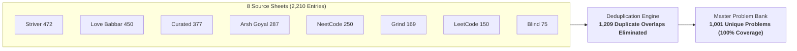

import MasterProblemExplorer from '@/components/MasterProblemExplorer';

# Master Problem Bank (1,001 Problems)

A **unified, 100% deduplicated master consolidation** of the top industry-standard DSA preparation sheets — eliminating redundant overlap across 8 major question banks and organizing them into a single high-efficiency tracker.

---

### Quick Stats & Coverage

| Metric | Details |
| :--- | :--- |
| **Total Unique Problems** | **1,001 Problems** *(1,209 cross-sheet duplicates removed from 2,210 raw entries)* |
| **Topic Coverage** | **12 Core Chapters** (Arrays, Strings, Linked Lists, Trees, Graphs, DP, Tries, Backtracking & more) |
| **Source Sheets Merged** | Striver A2Z, Love Babbar 450, NeetCode 250, Grind 75/169, LeetCode Top 150, Blind 75, Arsh Goyal |
| **Interactive Features** | Instant search, chapter filtering, multi-view toggle (Topic / Table / Cards), and local progress tracking |

---

### Source Sheet Breakdown

All major problem lists were cross-referenced and deduplicated into this single unified collection:

| Source Sheet | Original Count | Coverage in Master Bank | Key Focus Area |
| :--- | :---: | :---: | :--- |
| **[Striver SDE / A2Z Sheet](https://takeuforward.org/dsa/strivers-a2z-sheet-learn-dsa-a-to-z)** | 472 | 100% | End-to-end algorithmic mastery & topic-by-topic progression |
| **[Love Babbar 450 Sheet](https://www.geeksforgeeks.org/dsa/dsa-sheet-by-love-babbar/)** | 430 | 100% | Classic tech interview problems & foundational problem types |
| **[Curated 300 Roadmap](/dsa-list/full-300)** | 377 | 100% | High-yield pattern-based questions for fast revision |
| **[Arsh Goyal DSA Sheet](https://www.proelevate.in/dsa-practice/arsh-dsa-sheet)** | 287 | 100% | Top Tier-1 product company & FAANG interview sets |
| **[NeetCode 250](https://neetcode.io/practice/practice/neetcode250)** | 250 | 100% | Pattern recognition & optimal algorithmic intuition |
| **[Grind 75 / 169](https://www.techinterviewhandbook.org/grind75/)** | 169 | 100% | High-ROI interview prep ordered by frequency |
| **[LeetCode Top 150](https://leetcode.com/problem-list/plakya4j/)** | 150 | 100% | Official LeetCode canonical interview study roadmap |
| **[Blind 75](https://leetcode.com/discuss/general-discussion/460599/blind-75-leetcode-questions)** | 75 | 100% | Foundational coding interview benchmark list |

---

---

## Master Problem Explorer

Use the interactive explorer below to filter by chapter, search by problem title or pattern tag, and track your solved progress.

<MasterProblemExplorer />
