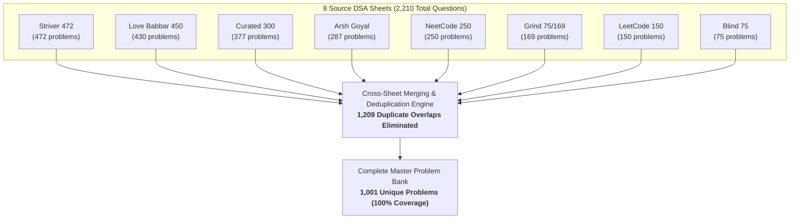

import MasterProblemExplorer from '@/components/MasterProblemExplorer';

# 1001-problem-list

This master problem bank is a **unified, deduplicated consolidation** of all the top industry-standard DSA preparation sheets found in the `dsa-questions` directory. By merging every source and stripping away duplicates, it provides **100% comprehensive coverage** organized into **interactive collapsible categories, instant search, and real-time progress tracking**.

## Source Sheets Breakdown

Each individual sheet was merged and cross-deduplicated into this single unified 1,001 problem bank:

| Sheet Name | Source / Sheet Link | Problem Count | Primary Focus |
| :--- | :--- | :---: | :--- |
| **Striver SDE / A2Z Sheet** | [Take U Forward A2Z](https://takeuforward.org/dsa/strivers-a2z-sheet-learn-dsa-a-to-z) | **472** | Core algorithms, data structures & patterns |
| **Love Babbar 450 Sheet** | [GeeksforGeeks Love Babbar](https://www.geeksforgeeks.org/dsa/dsa-sheet-by-love-babbar/) | **430** | Classic interview favorites & fundamentals |
| **Arsh Goyal DSA Sheet** | [Arsh Goyal DSA Sheet](https://www.proelevate.in/dsa-practice/arsh-dsa-sheet) | **287** | Top product-based company interview questions |
| **NeetCode 250** | [NeetCode 250](https://neetcode.io/practice/practice/neetcode250) | **250** | High-frequency pattern-based coding list |
| **Grind 75 / 169** | [Grind 75](https://www.techinterviewhandbook.org/grind75/?weeks=28&hours=6) | **169** | High-yield curated LeetCode questions |
| **LeetCode Top Interview 150** | [LeetCode Top 150](https://leetcode.com/problem-list/plakya4j/) | **150** | Official LeetCode top interview study plan |
| **Blind 75** | [Blind 75](https://leetcode.com/discuss/general-discussion/460599/blind-75-leetcode-questions) | **75** | Canonical baseline LeetCode problems |
| **Total Problems Across All Sheets** | — | **1,833** | *Contains 1,209 cross-sheet duplicates* |
| **Unified Master Problem Bank** | — | **1,001** | **100% deduplicated coverage of all 8 sheets** |

## Convergence & Deduplication Architecture

The diagram below illustrates how all 8 popular sheets converge into the 1,001 Master Problem Bank by eliminating **1,209 redundant cross-sheet duplicates**:

---

## 🎯 Master Problem Explorer (1,001 Problems Across 12 Chapters)

Filter by chapter, search by problem title or pattern, track your solved status with local persistence, and toggle between Topic, Table, and Card views.

<MasterProblemExplorer />
