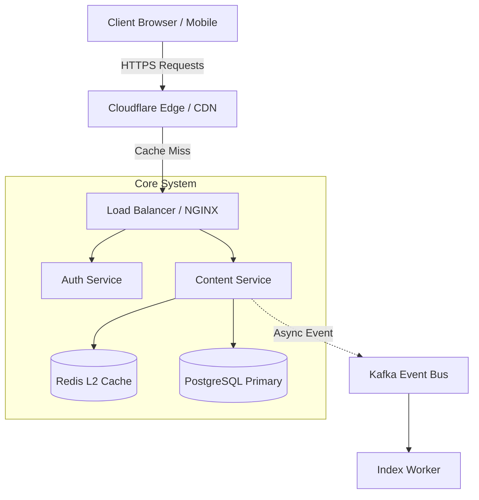
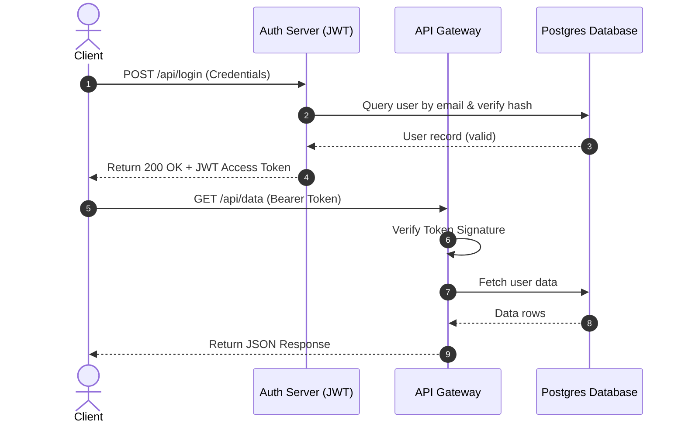
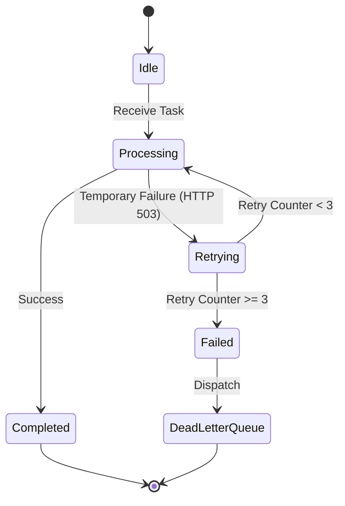
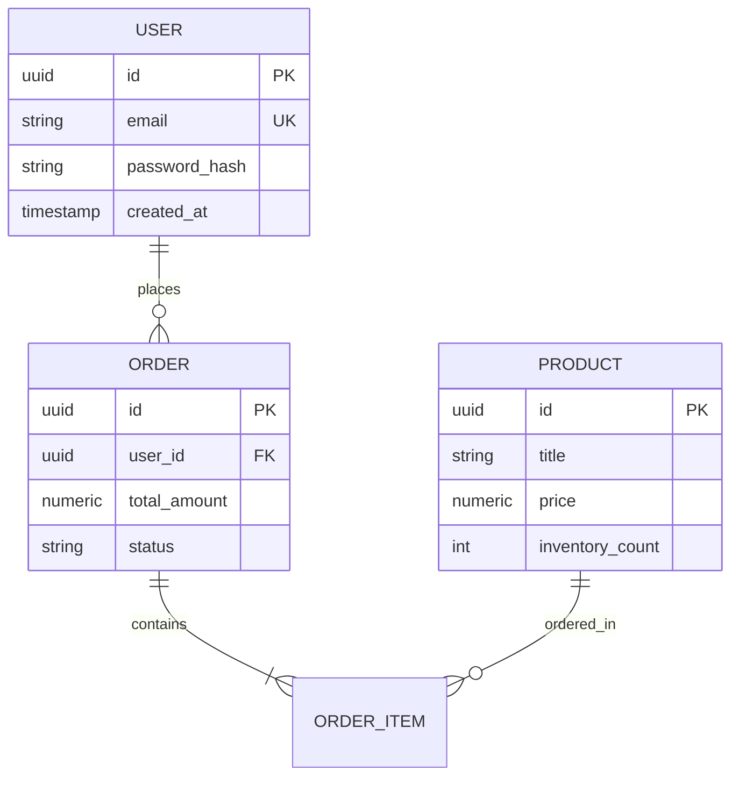
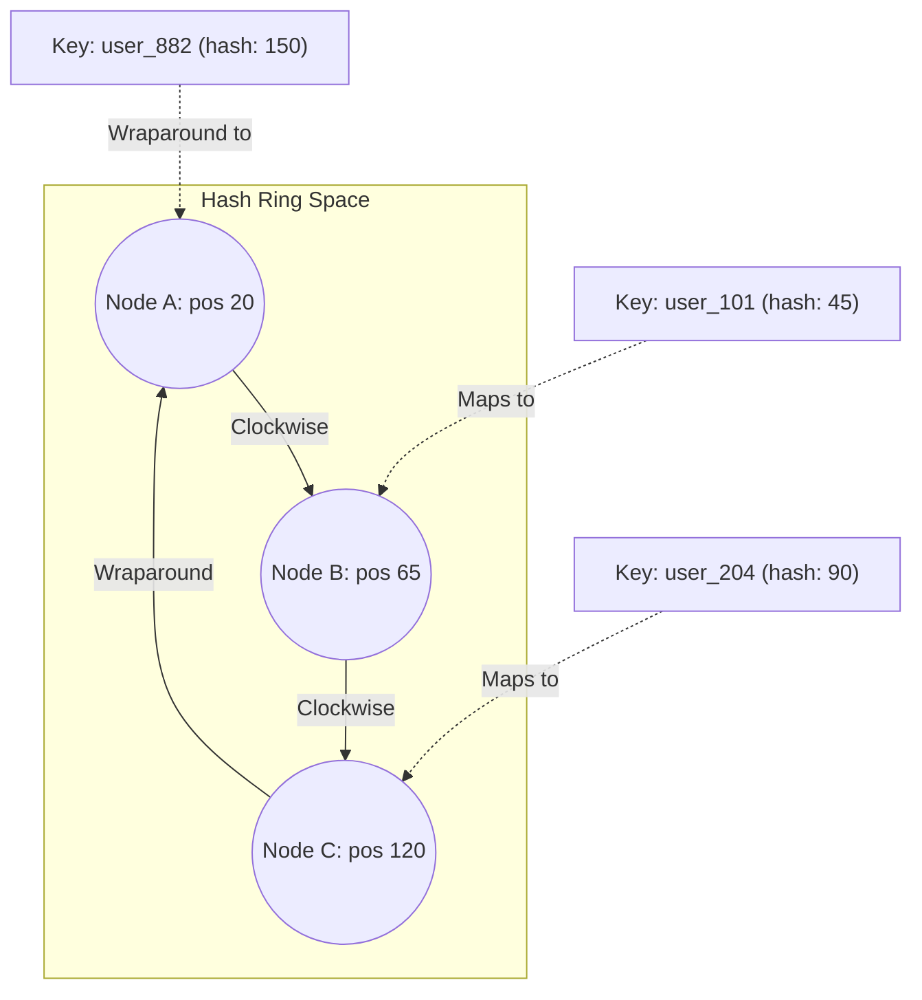

# Master Technical Article Authoring Skill Guide (`markdown-skill.md`)

> **Instructions for LLMs & Technical Writers**: When asked to create an article, guide, or technical breakdown, adhere strictly to the guidelines and specifications in this document. Incorporate rich visual elements, mathematical precision, interactive diagrams, and modern formatting to produce an engineering article of the highest quality.

---

## 1. Core Philosophy of an Exceptional Technical Article

An article written with this guide is not just plain text; it is an **interactive, multimedia learning canvas**. Every article must aim for:
1. **Visual Clarity**: Concepts explained via diagrams rather than walls of text.
2. **Mathematical Rigor**: Formal analysis with LaTeX equations for time/space complexity and algorithms.
3. **Engineered Code**: Production-grade, syntax-highlighted code with idiomatic structure and line comments.
4. **Scannability**: Visual callouts, badges, collapsible deep dives, and data tables.

---

## 2. Structural Blueprint of an Article

When crafting an article, follow this logical flow:

```
├── 1. Title & Metadata Badges (Topic, Difficulty, Read Time, Category)
├── 2. Hook & Executive Summary (Why this matters in 2-3 sentences)
├── 3. Architecture / Visual Mental Model (Mermaid Diagram)
├── 4. Theoretical Foundations & Math Formalism (KaTeX equations)
├── 5. Step-by-Step Implementation (Clean syntax-highlighted code)
├── 6. Comparative Complexity & Benchmarks (Markdown Table)
├── 7. Edge Cases, Pitfalls & Pro-Tips (Styled HTML Callouts)
├── 8. Deep Dive / Proofs (Collapsible <details> Accordions)
└── 9. Key Takeaways & Further Reading
```

---

## 3. Feature Syntax & Reference Guide

### 3.1. LaTeX & Mathematical Equations (KaTeX / MathJax)

Use math notation for all algorithm complexity, proofs, formulas, and recurrence relations.

* **Inline Math**: Wrap in single dollar signs `$ ... $` (do not leave spaces adjacent to the dollars).
  - *Example*: `$O(V + E)$`, `$E = mc^2$`, `$\Theta(N \log N)$`, `$2^{k-1}$`
* **Block Equations**: Wrap in double dollar signs `$$ ... $$` on their own lines.

#### Recurrence Relations & Complex Sums
```markdown
$$\sum_{i=1}^{n} i = \frac{n(n+1)}{2}$$

$$T(n) = 2T\left(\frac{n}{2}\right) + \Theta(n) \implies T(n) = \Theta(n \log n)$$
```

#### Limits, Integrals & Probabilities
```markdown
$$P(X = k) = \binom{n}{k} p^k (1-p)^{n-k}$$

$$\lim_{x \to \infty} \left(1 + \frac{1}{x}\right)^x = e$$
```

#### Matrix Representations
```markdown
$$M = \begin{pmatrix} 
a_{11} & a_{12} & \cdots & a_{1n} \\
a_{21} & a_{22} & \cdots & a_{2n} \\
\vdots & \vdots & \ddots & \vdots \\
a_{m1} & a_{m2} & \cdots & a_{mn}
\end{pmatrix}$$
```

---

### 3.2. Mermaid Diagrams

Provide at least **one** Mermaid diagram in every technical article to anchor visual understanding.

#### A. Architecture / Flowchart (`graph TD` or `graph LR`)
````markdown

````

#### B. Sequence Diagram (API Flows, Authentication, Handshakes)
````markdown

````

#### C. State Machine Diagram (`stateDiagram-v2`)
````markdown

````

#### D. Database Schema & Entity Relationship (`erDiagram`)
````markdown

````

---

### 3.3. Syntax-Highlighted Code Blocks

Always specify the language identifier immediately after the triple backticks (e.g. `python`, `typescript`, `cpp`, `go`, `sql`, `rust`, `bash`). Include informative variable names, type annotations, and descriptive comments.

````markdown
```typescript
interface CacheEntry<T> {
  value: T;
  expiresAt: number;
}

export class InMemoryTTL<T> {
  private store = new Map<string, CacheEntry<T>>();

  set(key: string, value: T, ttlMs: number): void {
    this.store.set(key, {
      value,
      expiresAt: Date.now() + ttlMs,
    });
  }

  get(key: string): T | null {
    const item = this.store.get(key);
    if (!item) return null;
    
    // Lazy expiration eviction
    if (Date.now() > item.expiresAt) {
      this.store.delete(key);
      return null;
    }
    return item.value;
  }
}
```
````

---

### 3.4. Styled HTML Components & Callouts

Use inline HTML styled with standard CSS that adapts naturally to both dark and light modes.

#### A. Modern Callout Boxes (Info, Tip, Warning, Danger)

**💡 Pro Tip Callout:**
```html
<div style="background: rgba(34, 197, 94, 0.08); border-left: 4px solid #22c55e; padding: 14px 18px; border-radius: 8px; margin: 20px 0;">
  <strong style="color: #22c55e; display: block; margin-bottom: 4px;">💡 Pro Tip</strong>
  <span>Always index foreign keys in PostgreSQL. Unindexed foreign keys can cause full-table locks during cascading deletions.</span>
</div>
```

**ℹ️ Note / Key Concept:**
```html
<div style="background: rgba(59, 130, 246, 0.08); border-left: 4px solid #3b82f6; padding: 14px 18px; border-radius: 8px; margin: 20px 0;">
  <strong style="color: #3b82f6; display: block; margin-bottom: 4px;">ℹ️ Key Concept</strong>
  <span>Consistent Hashing ensures that when a cache node joins or leaves, only <code>K / N</code> keys need to be remapped on average.</span>
</div>
```

**⚠️ Warning / Pitfall:**
```html
<div style="background: rgba(234, 179, 8, 0.08); border-left: 4px solid #eab308; padding: 14px 18px; border-radius: 8px; margin: 20px 0;">
  <strong style="color: #eab308; display: block; margin-bottom: 4px;">⚠️ Common Pitfall</strong>
  <span>Never store passwords with plain MD5 or SHA-256. Always use Argon2id or Bcrypt with a salt and high cost factor.</span>
</div>
```

#### B. Collapsible Deep Dives & Solution Hints (`<details>`)
```html
<details style="background: rgba(255, 255, 255, 0.03); border: 1px solid rgba(255, 255, 255, 0.12); border-radius: 8px; padding: 12px 16px; margin: 16px 0;">
  <summary style="font-weight: 600; cursor: pointer; color: var(--notion-text-primary);">
    🔍 Mathematical Proof: Master Theorem (Click to Expand)
  </summary>
  <div style="margin-top: 12px; font-size: 14px; line-height: 1.6; border-top: 1px solid rgba(255, 255, 255, 0.08); padding-top: 10px;">
    For recurrence equations of the form $T(n) = aT(n/b) + f(n)$, the critical value is the watershed exponent $c_{\text{crit}} = \log_b a$.
    Comparing $f(n)$ with $n^{\log_b a}$ determines which branch governs runtime asymptotic growth.
  </div>
</details>
```

#### C. Status & Complexity Badges
```html
<div style="display: flex; gap: 8px; flex-wrap: wrap; margin: 12px 0;">
  <span style="background: rgba(16, 185, 129, 0.12); color: #10b981; border: 1px solid rgba(16, 185, 129, 0.25); font-size: 12px; font-weight: 600; padding: 3px 10px; border-radius: 9999px;">Time: O(N log N)</span>
  <span style="background: rgba(59, 130, 246, 0.12); color: #3b82f6; border: 1px solid rgba(59, 130, 246, 0.25); font-size: 12px; font-weight: 600; padding: 3px 10px; border-radius: 9999px;">Space: O(1) Auxiliary</span>
  <span style="background: rgba(168, 85, 247, 0.12); color: #a855f7; border: 1px solid rgba(168, 85, 247, 0.25); font-size: 12px; font-weight: 600; padding: 3px 10px; border-radius: 9999px;">Difficulty: Medium</span>
</div>
```

#### D. Side-by-Side Comparison Cards
```html
<div style="display: grid; grid-template-columns: repeat(auto-fit, minmax(280px, 1fr)); gap: 16px; margin: 20px 0;">
  <div style="background: rgba(239, 68, 68, 0.05); border: 1px solid rgba(239, 68, 68, 0.2); border-radius: 8px; padding: 16px;">
    <h4 style="color: #ef4444; margin-top: 0; margin-bottom: 8px;">❌ Brute Force Approach</h4>
    <p style="font-size: 13px; line-height: 1.5; margin: 0;">Nested loops check every possible pair in the array. Inefficient for large datasets ($N > 10^5$).</p>
  </div>
  <div style="background: rgba(34, 197, 94, 0.05); border: 1px solid rgba(34, 197, 94, 0.2); border-radius: 8px; padding: 16px;">
    <h4 style="color: #22c55e; margin-top: 0; margin-bottom: 8px;">✅ Hash Map / Two-Pointer</h4>
    <p style="font-size: 13px; line-height: 1.5; margin: 0;">Single pass with $O(1)$ complement lookup reduces runtime dramatically from quadratic to linear.</p>
  </div>
</div>
```

---

### 3.5. Images & Responsive Media

#### A. Markdown Images with Captions
```markdown

*Figure 1.1: Multi-region deployment topology with asynchronous replication.*
```

#### B. Embedded Video Player (YouTube or HTML5)
```html
<div style="position: relative; padding-bottom: 56.25%; height: 0; overflow: hidden; border-radius: 8px; margin: 24px 0; border: 1px solid rgba(255,255,255,0.1);">
  <iframe 
    style="position: absolute; top: 0; left: 0; width: 100%; height: 100%; border: 0;"
    src="https://www.youtube-nocookie.com/embed/dQw4w9WgXcQ" 
    title="Algorithm Visualizer Walkthrough" 
    allow="accelerometer; autoplay; clipboard-write; encrypted-media; gyroscope; picture-in-picture" 
    allowfullscreen>
  </iframe>
</div>
```

---

### 3.6. Markdown Tables & Data Comparison

Format comparison tables cleanly with cell alignment (`:---`, `:---:`, `---:`):

```markdown
| Strategy | Time Complexity | Space Complexity | Thread Safe? | Recommended Use Case |
| :--- | :---: | :---: | :---: | :--- |
| **Linear Search** | $O(N)$ | $O(1)$ | Yes | Small or unsorted arrays ($N < 50$) |
| **Binary Search** | $O(\log N)$ | $O(1)$ | Yes | Sorted array or monotonic range |
| **Hash Index** | $O(1)$ | $O(N)$ | Depends | Exact key-value equality queries |
| **B-Tree Index** | $O(\log N)$ | $O(N)$ | Yes | Range scans (`BETWEEN`, `>`, `<`) |
```

---

### 3.7. Keyboard Shortcuts (`<kbd>`) & Hyperlinks

```markdown
- Navigate using <kbd>Ctrl</kbd> + <kbd>P</kbd> to open quick search.
- Press <kbd>Esc</kbd> to exit fullscreen view.
- For deep documentation, see [PostgreSQL Official Indexing Guide](https://www.postgresql.org/docs/current/indexes.html).
```

---

## 4. Complete Master Article Template

Below is a complete, copy-pasteable example of an article utilizing every single feature in this guide:

````markdown
# Consistent Hashing: Designing Distributed Systems at Scale

<div style="display: flex; gap: 8px; flex-wrap: wrap; margin-bottom: 16px;">
  <span style="background: rgba(59, 130, 246, 0.12); color: #3b82f6; border: 1px solid rgba(59, 130, 246, 0.25); font-size: 12px; font-weight: 600; padding: 2px 10px; border-radius: 9999px;">System Design</span>
  <span style="background: rgba(16, 185, 129, 0.12); color: #10b981; border: 1px solid rgba(16, 185, 129, 0.25); font-size: 12px; font-weight: 600; padding: 2px 10px; border-radius: 9999px;">Time: O(log N)</span>
  <span style="background: rgba(168, 85, 247, 0.12); color: #a855f7; border: 1px solid rgba(168, 85, 247, 0.25); font-size: 12px; font-weight: 600; padding: 2px 10px; border-radius: 9999px;">Difficulty: Hard</span>
</div>

In traditional distributed caching, partitioning keys across $N$ cache servers using simple modulo hashing (`hash(key) % N`) causes catastrophic cache stampedes when a server dies or scales up. **Consistent Hashing** resolves this by mapping both nodes and keys onto a circular hash ring.

---

### 1. High-Level Architecture

The circular hash ring maps hash outputs into the range $[0, 2^{32} - 1]$. Keys traverse clockwise to the nearest server node.



---

### 2. Mathematical Formalism

When adding or removing a node from a cluster with $K$ total keys and $N$ active nodes:

- Traditional Modulo Hashing invalidates:
  $$\text{Fraction of Invalidated Keys} \approx \frac{N-1}{N} \xrightarrow{N \to \infty} 100\%$$

- Consistent Hashing invalidates only:
  $$\text{Average Key Movements} = \frac{K}{N}$$

<div style="background: rgba(59, 130, 246, 0.08); border-left: 4px solid #3b82f6; padding: 12px 16px; border-radius: 6px; margin: 16px 0;">
  <strong style="color: #3b82f6;">ℹ️ The Virtual Node Theorem</strong><br/>
  To prevent non-uniform distribution (hotspots), each physical machine creates $V$ virtual replica tokens on the ring. The standard deviation of keys per node scales as $\sigma \approx \frac{1}{\sqrt{V}}$.
</div>

---

### 3. Implementation in TypeScript

````typescript
import crypto from "crypto";

export class ConsistentHashRing {
  private ring = new Map<number, string>();
  private sortedKeys: number[] = [];
  private replicas: number;

  constructor(replicas: number = 100) {
    this.replicas = replicas;
  }

  private hash(val: string): number {
    const hash = crypto.createHash("md5").update(val).digest();
    return hash.readUInt32BE(0);
  }

  public addNode(node: string): void {
    for (let i = 0; i < this.replicas; i++) {
      const hashVal = this.hash(`${node}#replica_${i}`);
      this.ring.set(hashVal, node);
      this.sortedKeys.push(hashVal);
    }
    this.sortedKeys.sort((a, b) => a - b);
  }

  public getNode(key: string): string | null {
    if (this.sortedKeys.length === 0) return null;
    const keyHash = this.hash(key);

    // Binary search for first ring node >= keyHash
    let low = 0;
    let high = this.sortedKeys.length - 1;
    let idx = 0;

    while (low <= high) {
      const mid = (low + high) >>> 1;
      if (this.sortedKeys[mid] >= keyHash) {
        idx = mid;
        high = mid - 1;
      } else {
        low = mid + 1;
      }
    }
    return this.ring.get(this.sortedKeys[idx]) || null;
  }
}
````

---

### 4. Strategy Comparison

| Metric | Modulo Hashing (`k % N`) | Consistent Hashing | Consistent Hashing with V-Nodes |
| :--- | :---: | :---: | :---: |
| **Node Addition Cost** | $O(K)$ keys migrated | $O(K/N)$ keys migrated | $O(K/N)$ keys uniformly spread |
| **Lookup Time** | $O(1)$ | $O(\log N)$ via Binary Search | $O(\log (N \cdot V))$ |
| **Load Skew Tolerance** | High variance | Sensitive to hash collisions | Uniform distribution ($\approx \pm 5\%$) |

---

### 5. Edge Cases & FAQs

<details style="background: rgba(255, 255, 255, 0.03); border: 1px solid rgba(255, 255, 255, 0.12); border-radius: 8px; padding: 12px 16px; margin: 16px 0;">
  <summary style="font-weight: 600; cursor: pointer;">
    ❓ What happens if the binary search reaches the end of the ring without finding a larger node?
  </summary>
  <div style="margin-top: 10px; font-size: 14px; line-height: 1.6;">
    The ring wraps around. If no node position is greater than or equal to the key's hash value, the key is assigned to the very first node at index <code>0</code> on the ring.
  </div>
</details>

<div style="background: rgba(234, 179, 8, 0.08); border-left: 4px solid #eab308; padding: 12px 16px; border-radius: 6px; margin: 16px 0;">
  <strong style="color: #eab308;">⚠️ Production Warning</strong><br/>
  Always combine consistent hashing with health-check heartbeats. If a node drops out silently without triggering ring reassignment, client requests to that node will timeout.
</div>
````

---

## 5. System Prompt to Feed into Any LLM

You can paste the prompt below into ChatGPT, Claude, Gemini, or any LLM to immediately generate an article with this exact quality:

```text
You are an elite Senior Staff Engineer and Technical Author.
Write a comprehensive, publication-ready technical article on the topic: "[YOUR TOPIC HERE]".

Adhere strictly to the following requirements:
1. Include inline math ($...$) and display formulas ($$...$$) for all complexity, bounds, and algorithms.
2. Include at least one informative Mermaid diagram (```mermaid graph TD or sequenceDiagram).
3. Include production-ready, typed code blocks with comments.
4. Include at least one comparative Markdown Table with alignment.
5. Include at least two styled HTML Callout boxes (e.g. Pro Tip, Key Concept, or Warning) using the inline styles provided in markdown-skill.md.
6. Include at least one collapsible <details><summary> deep dive or FAQ block.
7. Include top metadata badges for Category, Time Complexity, and Difficulty.
Make the article deep, rigorous, engaging, and clear.
```
